# 数据模型

MySQL 8.0 / InnoDB / `utf8mb4_0900_ai_ci`，共 **33 张表**，结构出自 `docs/references/database/init.sql`（结构与种子数据的唯一来源，仓库不提交增量迁移脚本）。

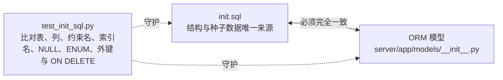

<Tabs :tabs="[
  { id: 'terms', title: '术语表' },
  { id: 'conventions', title: '公共约定' },
  { id: 'relations', title: '表清单与域关系' },
  { id: 'basics', title: '基础与平台表' },
  { id: 'imports', title: '导入、分享与快照表' },
  { id: 'purchase', title: '申购单据与物资' },
  { id: 'balance', title: '余额、策略、模板与图片' },
  { id: 'stock', title: '记录行、流水行与备忘' },
  { id: 'constraints', title: '约束与种子数据' }
]">

<TabsContent id="terms">

| 术语 | 代码标识 | 定义 |
| --- | --- | --- |
| 二级库 | `stock_material` | 电气车间自管小库，物资档案不要求物料编码；每条记录有稳定 `uuid`（小程序码扫码用） |
| 二级库精简模式 | `SecondaryWarehouseMode.LITE` | 二级库运行模式：完整模式 `full`（物资/出入库/流水）与精简模式 `lite`（Excel 全量导入 + 只读查询）；落在 `system_setting.secondary_warehouse_mode`，影响路由、菜单与写接口 |
| 精简库存表 | `lite_inventory` | 精简模式下的独立库存表：物资名称/型号规格/单位/数量/备注，全量替换导入 |
| 库存余额 / 库存流水 | `stock_balance.quantity`；`stock_operation` + `stock_operation_line` | 余额是查询加速数据，每物资一行，唯一合法写入口是流水重放 `inventory_service.replay_materials`；流水是出入库单据与明细，保存操作前后数量快照与物资快照，为审计依据 |
| 入库 / 出库 | `OperationType.INBOUND` / `OUTBOUND` | 两种流水类型；单号形如 `IN20260717000001` / `OUT...` |
| 冲销 | `SourceType.REVERSAL` + `reversal_of_id` | 以反向类型的新流水抵消原流水，按行记录 `remaining_qty`（剩余可冲数量），累计冲销不得超过原数量 |
| 初始化 / 小程序出库 | `SourceType.INITIALIZATION` / `SourceType.MINI_PROGRAM` | 初始化库存是首次建账入库（仍是正常入库流水，且只能是入库）；小程序出库落库时 `source_type` 记为 `MANUAL`，以 `mini_program_user_name_snapshot` 非空作为来源判据 |
| 安全库存 / 最低库存 | `stock_replenishment_policy.minimum_qty` | 每物资一条策略，可单独启用；`enabled=false` 时不计入低库存，`CHECK (minimum_qty >= 0)` |
| 低库存与建议申购数量 | `is_low_stock` / `suggested_purchase_qty` | 均查询时实时计算、不落库：低库存 = `policy.enabled && current_qty <= minimum_qty`；建议数量 = 近 6 个自然月内 `OUTBOUND` 且非冲销、未被冲销的流水数量之和 |
| 补库 | `ReplenishmentDraft` | 低库存物资一键生成一条申购计划（不创建申购记录），复制名称/规格/单位/备注/图片/二级库关联，并尝试复用最近一次编码 |
| 申购计划 | `purchase_material` | 一条记录代表一次申购计划；`plan_no` 形如 `PLAN-20260717-001`，同日序号递增，上限 999 |
| 未编码物资 | `material_code IS NULL` | 无独立状态字段；未编码计划不能转入申购记录，也不能导出采购申请表 |
| 申购记录 | `purchase_request` + `purchase_request_line` | 一条记录行对应一个计划快照 + 采购跟踪字段；转入时把计划字段全部快照到行上 |
| 申购单号 / 追溯号 | `purchase_request.purchase_order_no` / `purchase_request_line.trace_no` | 申购单号是公司系统单据号，默认「申购 2026/7/17」，可编辑，整单同步按它分组；追溯号是外部平台查询键，同一追溯号可命中多行 |
| 子项号 | `subitem_no` | 自由文本，用于标识设备/系统子项，非唯一键 |
| 申购状态 | `purchase_request_line.status` | `VARCHAR(128)`，默认「已申购」；取值由数据决定（筛选项由 `purchase_status_options` 从库中 distinct 得出），同步时「只进不退」 |
| 计划状态 | `PurchasePlanStatus` | `NORMAL`（正常）/ `DEFERRED`（暂不申购）/ `ARCHIVED`（已归档）；仅超级管理员可查询/打开已归档计划 |
| 周期性计划 | `purchase_plan_template` | 计划模板，`generate` 时复制为当天的一条申购计划，模板本身不改动 |
| 编码库 / 华星总库存 | `material_code_library` / `huaxing_inventory` | 均为 Excel 全量替换导入：前者是公司编码参照表（用于编码存在性校验），后者是上游总库库存快照（仅查询） |
| 图片 / 附件与悬空文件 | `file_object` / orphan | 磁盘 `data/uploads/{uuid7}.png` + 元数据行；上传时统一转 PNG 并按 SHA-256 去重。悬空文件指未被任何 `*_image` 关联表引用的记录、无记录的磁盘文件、缺失的磁盘文件，由超管接口清理 |
| 分享链接 | `share_link` | 匿名公开页 `/share/{token}`，token 为 UUIDv7；可配置展示列与失效时间，`columns=NULL` 表示默认列（全部列去掉「状态」） |
| 导出 / 导入任务 | `excel_export_job` / `excel_import_job` | 同一状态机 `PENDING → RUNNING → SUCCEEDED/FAILED`；导出成功后文件保留 3 天、按 uuid 匿名下载；导入同类型同时只允许一个进行中任务（409 `IMPORT_IN_PROGRESS`），完成后删临时文件 |
| 接口令牌 | `user.api_token_hash` / `api_token_enc` | 36 位令牌，SHA-256 哈希用于查找 + Fernet 密文用于界面回显；请求头 `X-API-Token` |
| 小程序功能模式 | `MiniProgramFeatureMode` | 每个小程序功能页三档：`disabled`（隐藏入口）/ `query_only`（只读）/ `read_write`（可写：库存可出库、隐患可登记与跟进）；只作用于小程序前端，后端数据接口不按它鉴权 |
| Webhook 投递 / 业务事件日志 | `webhook_delivery` / `business_event_log` | 前者是事件出站队列（最多 5 次尝试，退避 `1/5/15/60/180` 分钟）；后者记录库存流水创建/修改/冲销等动作的前后 JSON 快照与操作者（`common.log_event`） |
| MCP | `server/app/mcp_server.py` | 把 OpenAPI 里的业务接口暴露为 MCP 工具（`operations_list` / `operation_describe` / `operation_call`），按接口令牌对应的用户角色鉴权 |
| 隐患台账 / 整改闭环 | `hazard` | 现场隐患排查记录：登记（检查信息 + 责任单位 + 类型 + 整改前图片）→ 整改（整改员工 + 整改后图片 + 状态）→ 复查验收；责任人取自责任单位的快照，不随单位换人回写 |
| 隐患类型 | `hazard_type` | 一行一个「大类 + 小类」组合（如 `电气设备 / 绝缘破损`），无父子层级；同一组合唯一，隐患只引用行 id。隐患类型页把同一 `major` 的行按前端分组呈现为两级横向树，层级只存在于展示层。`init.sql` 预置 157 条组合（16 个大类）作为种子字典 |
| 责任单位 | `hazard_unit` | 单位与责任人一一对应；停用后不出现在登记下拉里，历史隐患仍保留名称与责任人快照 |
| 隐患登记幂等键 | `hazard.client_request_id` | 小程序登记隐患时生成一次、重试复用：重复提交返回同一条隐患而不是新增；网页端登记留空，因此「非空」也表示该条来自小程序 |
| 整改状态 / 隐患等级 | `HazardStatus` / `HazardLevel` | 状态三态：待整改 / 整改受阻 / 已整改；等级两档：一般隐患 / 重大隐患。逾期 = `due_date` 早于今天且状态非已整改（今天到期不算逾期） |
| 台账标签 | `ledger_tag` / `ledger.tag_ids` | 标签是自引用邻接表（`parent_id`），至多 3 层，同一层级下名称唯一；台账记录的标签以英文逗号分隔的标签 id 存在 `ledger.tag_ids`（空串 = 未挂标签），读接口按 id 回填名称与完整层级路径。孤立标签 = 既无父节点又无子节点，树标签 = 有父或有子；按标签筛选时命中选中标签及其全部子孙标签 |

</TabsContent>

<TabsContent id="conventions">

### 类型与精度

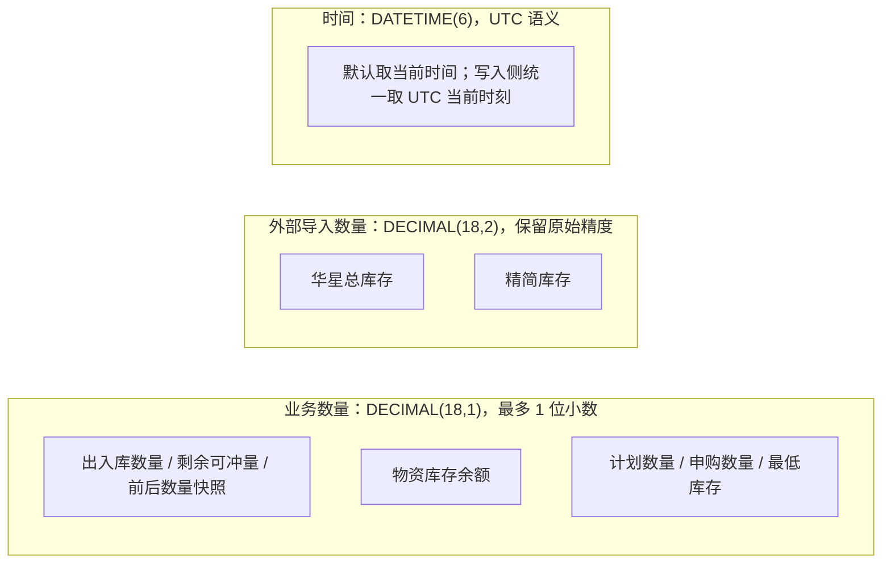

### 审计列组合

`AuditMixin` 提供 `created_at`、`updated_at`（更新时自动刷新）与 `version`（乐观锁版本）；字段明细表不再重复列出审计列。

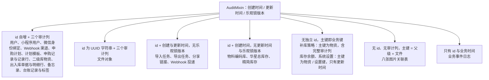

### 归属、删除与级联

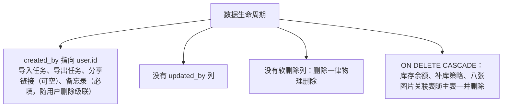

</TabsContent>

<TabsContent id="relations">

### 表清单（含 ORM 类名）

ORM 模型全部定义在 `server/app/models/__init__.py`（该目录下只有该文件）。

| 表名 | ORM 类名（`__tablename__` 同名） | 中文含义 | 所属域 |
| --- | --- | --- | --- |
| `user` | `User` | 管理端登录账号（含角色与接口令牌双列） | 用户 |
| `mini_program_user` | `MiniProgramUser` | 小程序用户档案 | 用户 |
| `mini_program_identity` | `MiniProgramIdentity` | 小程序用户与微信 OpenID 的绑定关系 | 用户 |
| `system_setting` | `SystemSetting` | 系统设置键值表 | 系统配置 |
| `business_event_log` | `BusinessEventLog` | 业务事件日志（状态流转与数据快照） | 系统配置 |
| `webhook_channel` | `WebhookChannel` | Webhook 渠道配置（飞书 / 钉钉） | Webhook |
| `webhook_delivery` | `WebhookDelivery` | Webhook 投递记录与重试状态 | Webhook |
| `file_object` | `FileObject` | 文件对象元数据（图片等） | 文件 |
| `excel_import_job` | `ExcelImportJob` | Excel 导入任务 | 导入导出 |
| `excel_export_job` | `ExcelExportJob` | Excel 导出任务（`file_uuid` 为派生属性，无独立列） | 导入导出 |
| `material_code_library` | `MaterialCodeLibrary` | 物资编码库（编码 / 名称 / 型号对照） | 导入导出 |
| `share_link` | `ShareLink` | 匿名分享链接 | 分享 |
| `stock_material` | `StockMaterial` | 二级库物资 | 二级库（完整模式） |
| `stock_balance` | `StockBalance` | 物资库存余额 | 二级库（完整模式） |
| `stock_replenishment_policy` | `StockReplenishmentPolicy` | 补库策略（最低库存阈值） | 二级库（完整模式） |
| `stock_operation` | `StockOperation` | 出入库单据头 | 二级库（完整模式） |
| `stock_operation_line` | `StockOperationLine` | 出入库单据明细行 | 二级库（完整模式） |
| `stock_material_image` | `StockMaterialImage` | 二级库物资图片关联 | 二级库（完整模式） |
| `lite_inventory` | `LiteInventory` | 精简二级库库存 | 二级库（精简模式） |
| `purchase_material` | `PurchaseMaterial` | 申购计划物资行 | 申购 |
| `purchase_material_image` | `PurchaseMaterialImage` | 申购计划图片关联 | 申购 |
| `purchase_plan_template` | `PurchasePlanTemplate` | 周期性申购计划模板 | 申购 |
| `purchase_plan_template_image` | `PurchasePlanTemplateImage` | 计划模板图片关联 | 申购 |
| `purchase_request` | `PurchaseRequest` | 申购记录头（订单 / 合同 / 船期等） | 申购 |
| `purchase_request_line` | `PurchaseRequestLine` | 申购记录物资行（含计划快照） | 申购 |
| `purchase_request_line_image` | `PurchaseRequestLineImage` | 申购记录行图片关联 | 申购 |
| `memo` | `Memo` | 个人备忘录 | 备忘 |
| `huaxing_inventory` | `HuaXingInventory` | 华兴库存（外部库存导入数据） | 华兴库存 |
| `hazard_unit` | `HazardUnit` | 隐患责任单位（单位与责任人一一对应） | 隐患管理 |
| `hazard_type` | `HazardType` | 隐患类型（一行一个「大类 + 小类」组合） | 隐患管理 |
| `hazard` | `Hazard` | 隐患台账主表（检查信息 + 责任人快照 + 整改状态） | 隐患管理 |
| `hazard_before_image` | `HazardBeforeImage` | 隐患「整改前」图片关联 | 隐患管理 |
| `hazard_after_image` | `HazardAfterImage` | 隐患「整改后」图片关联 | 隐患管理 |
| `ledger_tag` | `LedgerTag` | 台账标签节点（自引用邻接表，至多 3 层） | 台账管理 |
| `ledger_tag_image` | `LedgerTagImage` | 台账标签图片关联 | 台账管理 |
| `ledger` | `Ledger` | 台账记录（名称 / 型号 / 数量 / 备注 / 标签） | 台账管理 |
| `ledger_image` | `LedgerImage` | 台账记录图片关联 | 台账管理 |

`MiniProgramIdentity` 与 `SystemSetting` **未列入模型模块的 `__all__`**；`ExcelExportJob.file_uuid` 为派生属性，无独立列。

### 用户与身份

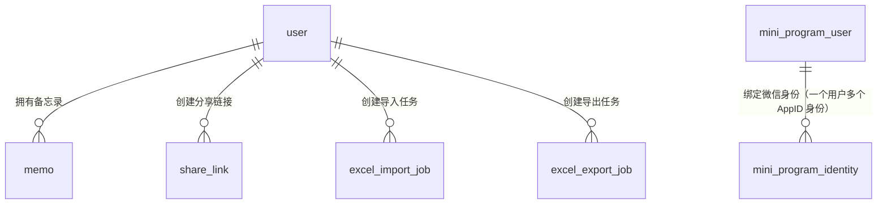

`user` 一人一个角色，接口令牌双列存储（查询用哈希 + 回显用密文）。

### 二级库库存

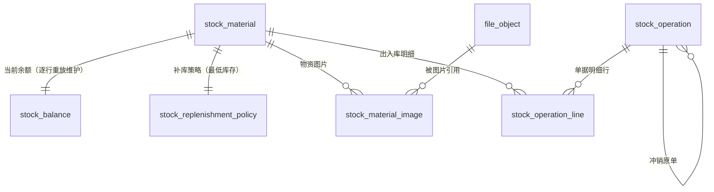

精简库存是独立表，与完整模式的物资、余额、流水没有外键关系。

### 申购与采购跟踪

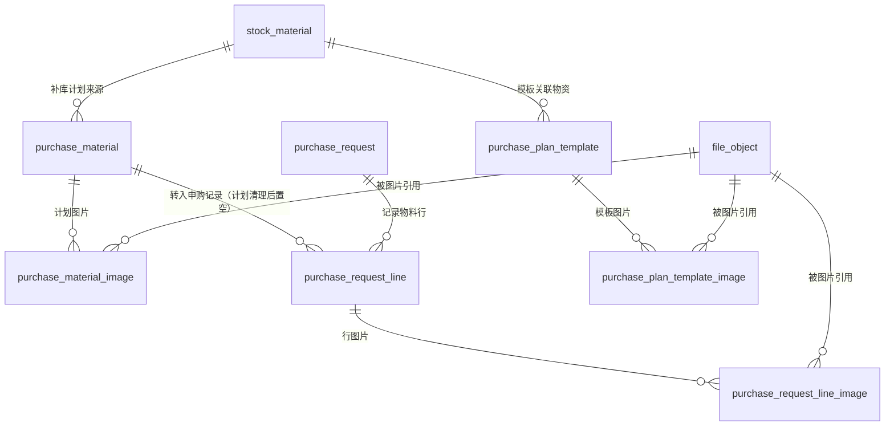

记录行保存计划快照，因此计划被每日清理任务删除后，采购跟踪字段仍然完整。

### 导入、文件与分享

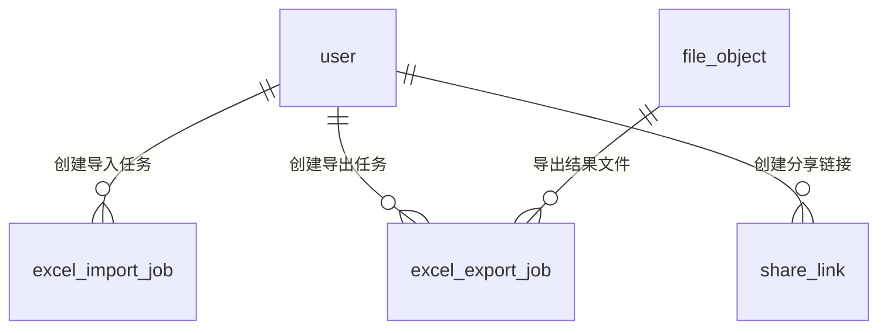

物料编码库、华星总库存、精简库存三张表是各自模块的全量替换导入结果，没有外键。

### Webhook、事件日志与设置

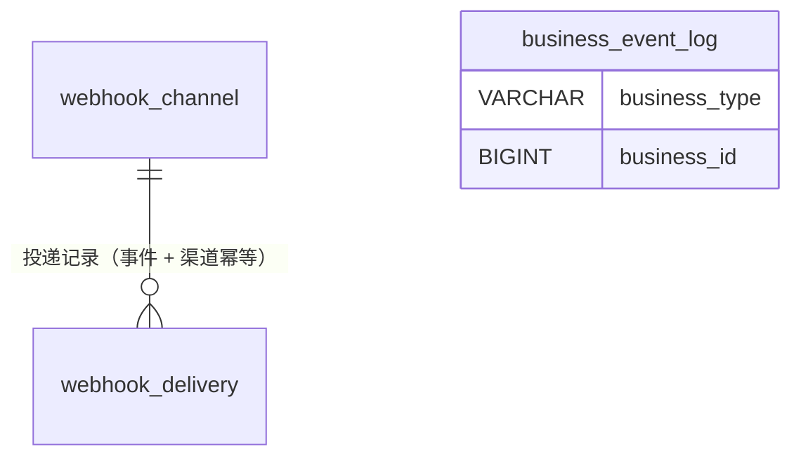

`business_event_log` 没有外键：`business_type` + `business_id` 弱关联任意业务表，仅靠实体索引检索。

### 隐患管理

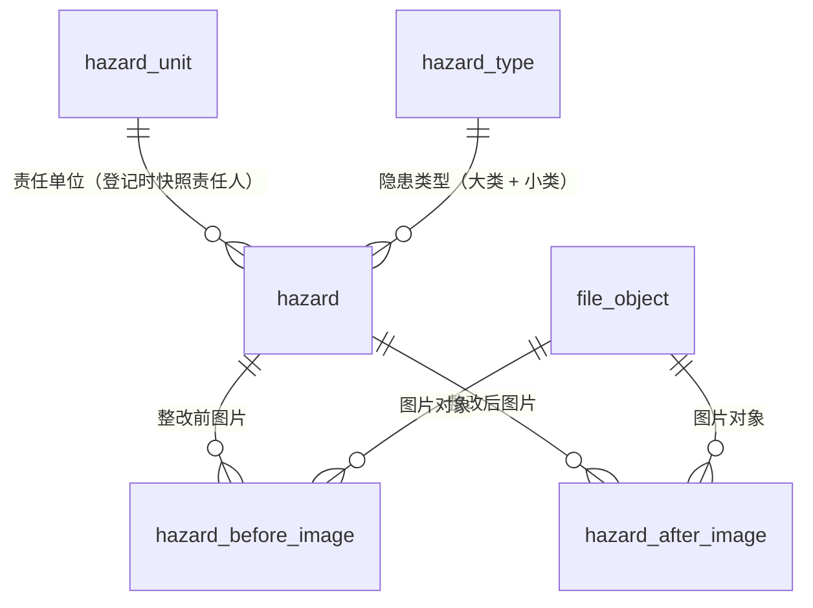

隐患的两张图片关联表与二级库/申购模块同一写法，因此附件管理的「被引用次数」把它们一并计入。

### 台账管理

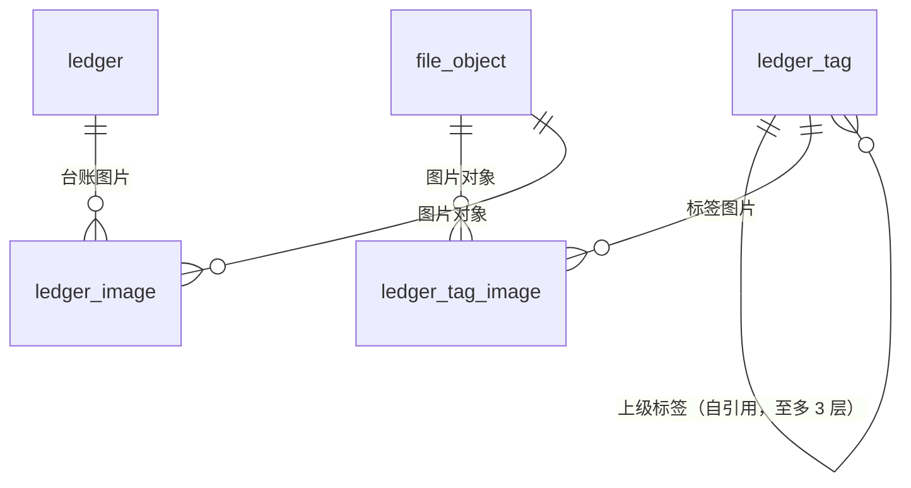

台账记录与标签**没有关联表**：一条记录的标签是 `ledger.tag_ids` 里的逗号分隔标签 id（读接口另外回填名称与完整路径），因此 ER 图里两者之间没有连线，标签的引用计数也由服务端按字符串匹配统计。`ledger_tag.parent_id` 的外键是 RESTRICT，删除父节点必须先删子节点；两张图片关联表沿用同一写法，附件管理的「被引用次数」同样把它们计入。

</TabsContent>

<TabsContent id="basics">

### 字段明细：基础与平台表

| 表 | 字段 | 类型 | NULL | 默认值 | 说明 |
| --- | --- | --- | --- | --- | --- |
| `user` | `id` | BIGINT UNSIGNED | 否 | 自增 | 主键 |
| `user` | `username` | VARCHAR(64) | 否 | 无 | 登录名，唯一 |
| `user` | `password_hash` | VARCHAR(255) | 否 | 无 | Argon2id 密码哈希 |
| `user` | `api_token_hash` | VARCHAR(64) | 否 | 无 | 接口令牌 SHA-256，唯一，用于认证查找 |
| `user` | `api_token_enc` | VARCHAR(512) | 否 | `''` | 接口令牌 Fernet 密文，供读取接口解密回显 |
| `user` | `display_name` | VARCHAR(128) | 否 | 无 | 显示名称 |
| `user` | `role` | ENUM('SUPER_ADMIN', 'WAREHOUSE_ADMIN', 'PURCHASE_ADMIN', 'HAZARD_ADMIN', 'READ_ONLY', 'LEDGER_ADMIN') | 否 | 无 | 角色，接口同名字符串 |
| `user` | `enabled` | TINYINT(1) | 否 | 1 | 账号是否启用 |
| `user` | *索引 / 外键* | — | — | — | 索引 `pk_user(id)`；唯一 `uq_user_username(username)`、`uq_user_api_token_hash(api_token_hash)`；外键：无 |
| `mini_program_user` | `id` | BIGINT UNSIGNED | 否 | 自增 | 主键 |
| `mini_program_user` | `display_name` | VARCHAR(128) | 否 | 无 | 姓名 |
| `mini_program_user` | `department_name` | VARCHAR(128) | 否 | `'华星检修维护部电气车间'` | 部门 |
| `mini_program_user` | `enabled` | TINYINT(1) | 否 | 1 | 是否允许使用小程序 |
| `mini_program_user` | `last_used_at` | DATETIME(6) | 是 | NULL | 最近一次登录小程序的时间（登录即刷新，不自增 version；本字段上线前建档的历史数据为 NULL） |
| `mini_program_user` | *索引 / 外键* | — | — | — | 索引 `pk_mini_program_user(id)`；外键：无 |
| `mini_program_identity` | `id` | BIGINT UNSIGNED | 否 | 自增 | 主键 |
| `mini_program_identity` | `mini_program_user_id` | BIGINT UNSIGNED | 否 | 无 | 关联小程序用户 |
| `mini_program_identity` | `app_id` | VARCHAR(64) | 否 | 无 | 小程序 AppID |
| `mini_program_identity` | `wechat_openid` | VARCHAR(128) | 否 | 无 | 微信 OpenID |
| `mini_program_identity` | *索引 / 外键* | — | — | — | 索引 `pk_mini_program_identity(id)`；唯一 `uq_mini_program_identity_app_id(app_id, wechat_openid)`、`uq_mini_program_identity_mini_program_user_id(mini_program_user_id, app_id)`；外键 `mini_program_user_id → mini_program_user.id`，`ON DELETE CASCADE` |
| `system_setting` | `setting_key` | VARCHAR(64) | 否 | 无 | 设置键，主键 |
| `system_setting` | `setting_value` | JSON | 否 | 无 | 设置值（JSON 文档） |
| `system_setting` | *索引 / 外键* | — | — | — | 索引 `pk_system_setting(setting_key)`；外键：无 |
| `business_event_log` | `id` | BIGINT UNSIGNED | 否 | 自增 | 主键 |
| `business_event_log` | `business_type` | VARCHAR(64) | 否 | 无 | 业务类型标识 |
| `business_event_log` | `business_id` | BIGINT UNSIGNED | 否 | 无 | 业务主键（弱关联，无外键） |
| `business_event_log` | `action` | VARCHAR(64) | 否 | 无 | 动作标识 |
| `business_event_log` | `old_status` | VARCHAR(32) | 是 | NULL | 变更前状态 |
| `business_event_log` | `new_status` | VARCHAR(32) | 是 | NULL | 变更后状态 |
| `business_event_log` | `occurred_at` | DATETIME(6) | 否 | CURRENT_TIMESTAMP(6) | 事件发生时间 |
| `business_event_log` | `remark` | VARCHAR(1000) | 是 | NULL | 备注 |
| `business_event_log` | `before_data` | JSON | 是 | NULL | 变更前数据快照 |
| `business_event_log` | `after_data` | JSON | 是 | NULL | 变更后数据快照 |
| `business_event_log` | *索引 / 外键* | — | — | — | 索引 `pk_business_event_log(id)`、`ix_business_event_entity(business_type, business_id, id)`；外键：无 |
| `webhook_channel` | `id` | BIGINT UNSIGNED | 否 | 自增 | 主键 |
| `webhook_channel` | `platform` | ENUM('FEISHU','DINGTALK') | 否 | 无 | 渠道平台，唯一 |
| `webhook_channel` | `enabled` | TINYINT(1) | 否 | 0 | 是否启用该渠道 |
| `webhook_channel` | `webhook_url_encrypted` | VARCHAR(2000) | 否 | `''` | 加密后的 Webhook 地址 |
| `webhook_channel` | `secret_encrypted` | VARCHAR(2000) | 否 | `''` | 加密后的签名密钥 |
| `webhook_channel` | `subscribed_events` | JSON | 否 | 无 | 订阅事件名数组 |
| `webhook_channel` | *索引 / 外键* | — | — | — | 索引 `pk_webhook_channel(id)`；唯一 `uq_webhook_channel_platform(platform)`；外键：无 |
| `webhook_delivery` | `id` | BIGINT UNSIGNED | 否 | 自增 | 主键 |
| `webhook_delivery` | `event_id` | VARCHAR(36) | 否 | 无 | 事件 id（与 `channel_id` 组合唯一，幂等） |
| `webhook_delivery` | `event_type` | ENUM('STOCK_OUTBOUND_CREATED','STOCK_INBOUND_CREATED','MINI_PROGRAM_USER_BOUND') | 否 | 无 | 事件类型，接口值为 `stock.outbound.created` / `stock.inbound.created` / `mini_program.user.bound` |
| `webhook_delivery` | `channel_id` | BIGINT UNSIGNED | 否 | 无 | 目标渠道 |
| `webhook_delivery` | `payload` | JSON | 否 | 无 | 投递报文 |
| `webhook_delivery` | `status` | ENUM('PENDING','SENDING','SUCCEEDED','FAILED') | 否 | `'PENDING'` | 投递状态 |
| `webhook_delivery` | `attempts` | TINYINT UNSIGNED | 否 | 0 | 已尝试次数 |
| `webhook_delivery` | `next_retry_at` | DATETIME(6) | 否 | CURRENT_TIMESTAMP(6) | 下次重试时间 |
| `webhook_delivery` | `response_status` | INT | 是 | NULL | 响应 HTTP 状态码 |
| `webhook_delivery` | `response_excerpt` | VARCHAR(1000) | 是 | NULL | 响应摘录 |
| `webhook_delivery` | `last_error` | VARCHAR(1000) | 是 | NULL | 最近错误信息 |
| `webhook_delivery` | `delivered_at` | DATETIME(6) | 是 | NULL | 投递成功时间 |
| `webhook_delivery` | *索引 / 外键* | — | — | — | 索引 `pk_webhook_delivery(id)`；唯一 `uq_webhook_delivery_event_id(event_id, channel_id)`；`ix_webhook_delivery_pending(status, next_retry_at, id)`；外键 `channel_id → webhook_channel.id`（无 `ON DELETE` 子句，即 RESTRICT） |
| `file_object` | `id` | VARCHAR(36) | 否 | 无 | 主键，UUID 字符串（`uuid7_string`） |
| `file_object` | `original_name` | VARCHAR(255) | 否 | 无 | 原始文件名 |
| `file_object` | `mime_type` | VARCHAR(32) | 否 | 无 | MIME 类型 |
| `file_object` | `size_bytes` | BIGINT UNSIGNED | 否 | 无 | 文件字节数 |
| `file_object` | `width` | INT | 否 | 无 | 图片宽度 |
| `file_object` | `height` | INT | 否 | 无 | 图片高度 |
| `file_object` | `sha256` | VARCHAR(64) | 否 | 无 | 内容哈希（非唯一索引） |
| `file_object` | `deleted_at` | DATETIME(6) | 是 | NULL | 软删除时间；非空表示等待次日凌晨 2 点复查引用后物理清除 |
| `file_object` | *索引 / 外键* | — | — | — | 索引 `pk_file_object(id)`、`ix_file_object_sha256(sha256)`、`ix_file_object_deleted_at(deleted_at)`；外键：无（由各图片关联表引用本表） |

</TabsContent>

<TabsContent id="imports">

### 字段明细：导入、分享与快照表

| 表 | 字段 | 类型 | NULL | 默认值 | 说明 |
| --- | --- | --- | --- | --- | --- |
| `excel_import_job` | `id` | BIGINT UNSIGNED | 否 | 自增 | 主键 |
| `excel_import_job` | `import_type` | VARCHAR(32) | 否 | 无 | 导入类型标识 |
| `excel_import_job` | `status` | ENUM('PENDING','RUNNING','SUCCEEDED','FAILED') | 否 | `'PENDING'` | 任务状态 |
| `excel_import_job` | `original_filename` | VARCHAR(255) | 否 | 无 | 上传文件名 |
| `excel_import_job` | `file_path` | VARCHAR(500) | 否 | 无 | 上传文件落盘路径 |
| `excel_import_job` | `result` | JSON | 是 | NULL | 导入结果统计 |
| `excel_import_job` | `error_code` | VARCHAR(64) | 是 | NULL | 错误码 |
| `excel_import_job` | `error_message` | VARCHAR(1000) | 是 | NULL | 错误信息 |
| `excel_import_job` | `created_by` | BIGINT UNSIGNED | 是 | NULL | 创建人 |
| `excel_import_job` | `started_at` | DATETIME(6) | 是 | NULL | 开始执行时间 |
| `excel_import_job` | `finished_at` | DATETIME(6) | 是 | NULL | 结束时间 |
| `excel_import_job` | *索引 / 外键* | — | — | — | 索引 `pk_excel_import_job(id)`、`ix_excel_import_job_type_status(import_type, status, id)`；外键 `created_by → user.id`（无 `ON DELETE` 子句，即 RESTRICT） |
| `excel_export_job` | `id` | BIGINT UNSIGNED | 否 | 自增 | 主键 |
| `excel_export_job` | `export_type` | VARCHAR(32) | 否 | 无 | 导出类型标识 |
| `excel_export_job` | `status` | ENUM('PENDING','RUNNING','SUCCEEDED','FAILED') | 否 | `'PENDING'` | 任务状态 |
| `excel_export_job` | `download_filename` | VARCHAR(255) | 是 | NULL | 下载文件名 |
| `excel_export_job` | `file_path` | VARCHAR(500) | 是 | NULL | 生成文件路径（成功保留至保留期） |
| `excel_export_job` | `params` | JSON | 是 | NULL | 导出参数快照 |
| `excel_export_job` | `result` | JSON | 是 | NULL | 导出结果统计 |
| `excel_export_job` | `error_code` | VARCHAR(64) | 是 | NULL | 错误码 |
| `excel_export_job` | `error_message` | VARCHAR(1000) | 是 | NULL | 错误信息 |
| `excel_export_job` | `created_by` | BIGINT UNSIGNED | 是 | NULL | 创建人 |
| `excel_export_job` | `started_at` | DATETIME(6) | 是 | NULL | 开始执行时间 |
| `excel_export_job` | `finished_at` | DATETIME(6) | 是 | NULL | 结束时间 |
| `excel_export_job` | *索引 / 外键* | — | — | — | 索引 `pk_excel_export_job(id)`、`ix_excel_export_job_type_status(export_type, status, id)`；外键 `created_by → user.id`（无 `ON DELETE` 子句，即 RESTRICT） |
| `material_code_library` | `id` | BIGINT UNSIGNED | 否 | 自增 | 主键 |
| `material_code_library` | `material_code` | VARCHAR(64) | 否 | 无 | 物资编码，唯一 |
| `material_code_library` | `name` | VARCHAR(128) | 是 | NULL | 名称 |
| `material_code_library` | `model_spec` | VARCHAR(255) | 是 | NULL | 型号规格 |
| `material_code_library` | `unit_name` | VARCHAR(32) | 否 | 无 | 单位 |
| `material_code_library` | *索引 / 外键* | — | — | — | 索引 `pk_material_code_library(id)`；唯一 `uq_material_code_library_material_code(material_code)`；外键：无 |
| `share_link` | `id` | BIGINT UNSIGNED | 否 | 自增 | 主键 |
| `share_link` | `token` | VARCHAR(36) | 否 | 无 | 分享令牌（UUID，唯一，不可猜解） |
| `share_link` | `share_type` | ENUM('PURCHASE_PLAN','PURCHASE_RECORD') | 否 | 无 | 分享数据类型，接口值为 `purchase_plan` / `purchase_record` |
| `share_link` | `item_ids` | JSON | 否 | 无 | 被分享数据行 id 数组（弱关联） |
| `share_link` | `columns` | JSON | 是 | NULL | 展示列键名数组；NULL 表示全部默认列 |
| `share_link` | `expires_at` | DATETIME(6) | 是 | NULL | 失效时间；NULL 表示永久有效 |
| `share_link` | `created_by` | BIGINT UNSIGNED | 是 | NULL | 创建人 |
| `share_link` | *索引 / 外键* | — | — | — | 索引 `pk_share_link(id)`；唯一 `uq_share_link_token(token)`；`ix_share_link_expires_at(expires_at)`、`ix_share_link_share_type(share_type)`；外键 `created_by → user.id`（无 `ON DELETE` 子句，即 RESTRICT） |
| `huaxing_inventory` | `id` | BIGINT UNSIGNED | 否 | 自增 | 主键 |
| `huaxing_inventory` | `first_inbound_date` | DATE | 是 | NULL | 首次入库日期 |
| `huaxing_inventory` | `warehouse` | VARCHAR(128) | 是 | NULL | 仓库 |
| `huaxing_inventory` | `material_code` | VARCHAR(64) | 是 | NULL | 物资编码 |
| `huaxing_inventory` | `name` | VARCHAR(255) | 是 | NULL | 名称 |
| `huaxing_inventory` | `model_spec` | VARCHAR(255) | 是 | NULL | 型号规格 |
| `huaxing_inventory` | `quantity` | DECIMAL(18, 2) | 是 | NULL | 数量（外部导入原始精度） |
| `huaxing_inventory` | `unit_name` | VARCHAR(32) | 是 | NULL | 单位 |
| `huaxing_inventory` | `purchaser` | VARCHAR(128) | 是 | NULL | 申购人 |
| `huaxing_inventory` | `purchase_department` | VARCHAR(128) | 是 | NULL | 申购部门 |
| `huaxing_inventory` | `subitem_no_name` | VARCHAR(255) | 是 | NULL | 子项号名称 |
| `huaxing_inventory` | *索引 / 外键* | — | — | — | 索引 `pk_huaxing_inventory(id)`；外键：无 |
| `lite_inventory` | `id` | BIGINT UNSIGNED | 否 | 自增 | 主键 |
| `lite_inventory` | `name` | VARCHAR(128) | 否 | 无 | 名称 |
| `lite_inventory` | `model_spec` | VARCHAR(255) | 是 | NULL | 型号规格 |
| `lite_inventory` | `unit_name` | VARCHAR(32) | 是 | NULL | 单位 |
| `lite_inventory` | `quantity` | DECIMAL(18, 2) | 是 | NULL | 数量（导入原始精度） |
| `lite_inventory` | `remark` | VARCHAR(1000) | 是 | NULL | 备注 |
| `lite_inventory` | *索引 / 外键* | — | — | — | 索引 `pk_lite_inventory(id)`；外键：无 |

</TabsContent>

<TabsContent id="purchase">

### 字段明细：申购单据与物资

| 表 | 字段 | 类型 | NULL | 默认值 | 说明 |
| --- | --- | --- | --- | --- | --- |
| `purchase_request` | `id` | BIGINT UNSIGNED | 否 | 自增 | 主键 |
| `purchase_request` | `purchase_order_no` | VARCHAR(128) | 是 | NULL | 采购订单号 |
| `purchase_request` | `contract_no` | VARCHAR(128) | 是 | NULL | 合同号 |
| `purchase_request` | `vessel_no` | VARCHAR(128) | 是 | NULL | 船号 |
| `purchase_request` | `consolidation_date` | DATE | 是 | NULL | 集港日期 |
| `purchase_request` | `consolidation_port` | VARCHAR(128) | 是 | NULL | 集港港口 |
| `purchase_request` | `sailing_date` | DATE | 是 | NULL | 开船日期 |
| `purchase_request` | `remark` | VARCHAR(1000) | 是 | NULL | 备注 |
| `purchase_request` | `purchase_date` | DATE | 是 | NULL | 采购日期 |
| `purchase_request` | *索引 / 外键* | — | — | — | 索引 `pk_purchase_request(id)`；外键：无 |
| `stock_material` | `id` | BIGINT UNSIGNED | 否 | 自增 | 主键 |
| `stock_material` | `uuid` | VARCHAR(36) | 否 | 无 | 对外 UUID，唯一 |
| `stock_material` | `name` | VARCHAR(128) | 否 | 无 | 名称 |
| `stock_material` | `name_id` | VARCHAR(128) | 是 | NULL | 名称编号（别名索引） |
| `stock_material` | `alias` | VARCHAR(128) | 是 | NULL | 别名 |
| `stock_material` | `model_spec` | VARCHAR(255) | 否 | 无 | 型号规格 |
| `stock_material` | `unit_name` | VARCHAR(32) | 否 | 无 | 单位 |
| `stock_material` | `remark` | VARCHAR(1000) | 是 | NULL | 备注 |
| `stock_material` | `identity_hash` | VARCHAR(64) | 否 | 无 | 名称+型号+单位归一化哈希，唯一，用于去重 |
| `stock_material` | *索引 / 外键* | — | — | — | 索引 `pk_stock_material(id)`；唯一 `uq_stock_material_uuid(uuid)`、`uq_stock_material_identity_hash(identity_hash)`；外键：无 |
| `stock_operation` | `id` | BIGINT UNSIGNED | 否 | 自增 | 主键 |
| `stock_operation` | `operation_no` | VARCHAR(32) | 否 | 无 | 单据编号，唯一 |
| `stock_operation` | `operation_type` | ENUM('INBOUND','OUTBOUND') | 否 | 无 | 出入库方向 |
| `stock_operation` | `occurred_at` | DATETIME(6) | 否 | 无 | 业务发生时间（必填，无默认值） |
| `stock_operation` | `business_reason` | VARCHAR(500) | 否 | 无 | 业务原因 |
| `stock_operation` | `receiver_unit` | VARCHAR(128) | 是 | NULL | 领用单位 |
| `stock_operation` | `receiver_name` | VARCHAR(64) | 是 | NULL | 领用人 |
| `stock_operation` | `subitem_no` | VARCHAR(64) | 是 | NULL | 子项号 |
| `stock_operation` | `source_type` | ENUM('MANUAL','MINI_PROGRAM','REVERSAL','INITIALIZATION') | 否 | 无 | 来源：管理端/小程序/冲销/初始化 |
| `stock_operation` | `reversal_of_id` | BIGINT UNSIGNED | 是 | NULL | 被冲销单据（自引用） |
| `stock_operation` | `client_request_id` | VARCHAR(64) | 否 | 无 | 客户端请求 id，唯一，幂等键 |
| `stock_operation` | `mini_program_user_name_snapshot` | VARCHAR(128) | 是 | NULL | 小程序提交人姓名快照 |
| `stock_operation` | *索引 / 外键* | — | — | — | 索引 `pk_stock_operation(id)`；唯一 `uq_stock_operation_operation_no(operation_no)`、`uq_stock_operation_client_request_id(client_request_id)`；`ix_stock_operation_occurred_at(occurred_at)`、`ix_stock_operation_source_occurred(source_type, occurred_at)`、`ix_stock_operation_type_occurred(operation_type, occurred_at)`、`ix_stock_operation_reversal_of_id(reversal_of_id)`；外键 `reversal_of_id → stock_operation.id`（无 `ON DELETE` 子句，即 RESTRICT） |
| `purchase_material` | `id` | BIGINT UNSIGNED | 否 | 自增 | 主键 |
| `purchase_material` | `plan_no` | VARCHAR(32) | 否 | 无 | 计划编号，唯一 |
| `purchase_material` | `plan_date` | DATE | 否 | 无 | 计划日期 |
| `purchase_material` | `material_code` | VARCHAR(64) | 是 | NULL | 物资编码；NULL 即未编码 |
| `purchase_material` | `category` | VARCHAR(64) | 是 | NULL | 分类 |
| `purchase_material` | `urgency` | VARCHAR(32) | 否 | `'正常'` | 紧急程度 |
| `purchase_material` | `demand_department` | VARCHAR(128) | 否 | `'HXNI 检修维护部'` | 需求部门 |
| `purchase_material` | `name` | VARCHAR(128) | 否 | 无 | 名称 |
| `purchase_material` | `model_spec` | VARCHAR(255) | 否 | 无 | 型号规格 |
| `purchase_material` | `unit_name` | VARCHAR(32) | 否 | 无 | 单位 |
| `purchase_material` | `actual_demand_person` | VARCHAR(128) | 否 | 无 | 实际需求人 |
| `purchase_material` | `purchase_responsible` | VARCHAR(128) | 否 | 无 | 采购负责人 |
| `purchase_material` | `planned_qty` | DECIMAL(18, 1) | 否 | 无 | 计划数量 |
| `purchase_material` | `usage` | VARCHAR(500) | 否 | 无 | 用途 |
| `purchase_material` | `subitem_no` | VARCHAR(64) | 是 | NULL | 子项号 |
| `purchase_material` | `remark` | VARCHAR(1000) | 是 | NULL | 备注 |
| `purchase_material` | `stock_material_id` | BIGINT UNSIGNED | 是 | NULL | 关联二级库物资 |
| `purchase_material` | `status` | ENUM('NORMAL','DEFERRED','ARCHIVED') | 否 | `'NORMAL'` | 计划状态，接口序列化为 正常 / 暂不申购 / 已归档 |
| `purchase_material` | *索引 / 外键* | — | — | — | 索引 `pk_purchase_material(id)`；唯一 `uq_purchase_material_plan_no(plan_no)`；`ix_purchase_material_status(status)`、`ix_purchase_material_stock_material_id(stock_material_id)`；外键 `stock_material_id → stock_material.id`（无 `ON DELETE` 子句，即 RESTRICT） |

</TabsContent>

<TabsContent id="balance">

### 字段明细：余额、策略、模板与图片

| 表 | 字段 | 类型 | NULL | 默认值 | 说明 |
| --- | --- | --- | --- | --- | --- |
| `stock_balance` | `stock_material_id` | BIGINT UNSIGNED | 否 | 无 | 主键，1:1 关联物资 |
| `stock_balance` | `quantity` | DECIMAL(18, 1) | 否 | 0 | 当前余额 |
| `stock_balance` | *索引 / 外键* | — | — | — | 索引 `pk_stock_balance(stock_material_id)`；外键 `stock_material_id → stock_material.id`，`ON DELETE CASCADE` |
| `stock_material_image` | `material_id` | BIGINT UNSIGNED | 否 | 无 | 主键之一，关联物资 |
| `stock_material_image` | `file_id` | VARCHAR(36) | 否 | 无 | 主键之一，关联文件 |
| `stock_material_image` | `sort_order` | TINYINT UNSIGNED | 否 | 0 | 展示排序 |
| `stock_material_image` | *索引 / 外键* | — | — | — | 索引 `pk_stock_material_image(material_id, file_id)`；外键 `material_id → stock_material.id`（`ON DELETE CASCADE`）、`file_id → file_object.id`（无 `ON DELETE` 子句，即 RESTRICT） |
| `stock_replenishment_policy` | `stock_material_id` | BIGINT UNSIGNED | 否 | 无 | 主键，1:1 关联物资 |
| `stock_replenishment_policy` | `minimum_qty` | DECIMAL(18, 1) | 否 | 无 | 最低库存阈值，`CHECK (minimum_qty >= 0)` |
| `stock_replenishment_policy` | `enabled` | TINYINT(1) | 否 | 1 | 是否启用补库策略 |
| `stock_replenishment_policy` | *索引 / 外键* | — | — | — | 索引 `pk_stock_replenishment_policy(stock_material_id)`；检查约束 `ck_stock_replenishment_policy_minimum_nonnegative`；外键 `stock_material_id → stock_material.id`，`ON DELETE CASCADE` |
| `purchase_material_image` | `material_id` | BIGINT UNSIGNED | 否 | 无 | 主键之一，关联申购计划 |
| `purchase_material_image` | `file_id` | VARCHAR(36) | 否 | 无 | 主键之一，关联文件 |
| `purchase_material_image` | `sort_order` | TINYINT UNSIGNED | 否 | 0 | 展示排序 |
| `purchase_material_image` | *索引 / 外键* | — | — | — | 索引 `pk_purchase_material_image(material_id, file_id)`；外键 `material_id → purchase_material.id`（`ON DELETE CASCADE`）、`file_id → file_object.id`（无 `ON DELETE` 子句，即 RESTRICT） |
| `purchase_plan_template` | `id` | BIGINT UNSIGNED | 否 | 自增 | 主键 |
| `purchase_plan_template` | `material_code` | VARCHAR(64) | 是 | NULL | 物资编码；NULL 即未编码 |
| `purchase_plan_template` | `category` | VARCHAR(64) | 是 | NULL | 分类 |
| `purchase_plan_template` | `urgency` | VARCHAR(32) | 否 | `'正常'` | 紧急程度 |
| `purchase_plan_template` | `demand_department` | VARCHAR(128) | 否 | `'HXNI 检修维护部'` | 需求部门 |
| `purchase_plan_template` | `name` | VARCHAR(128) | 否 | 无 | 名称 |
| `purchase_plan_template` | `model_spec` | VARCHAR(255) | 否 | 无 | 型号规格 |
| `purchase_plan_template` | `unit_name` | VARCHAR(32) | 否 | 无 | 单位 |
| `purchase_plan_template` | `actual_demand_person` | VARCHAR(128) | 否 | 无 | 实际需求人 |
| `purchase_plan_template` | `purchase_responsible` | VARCHAR(128) | 否 | 无 | 采购负责人 |
| `purchase_plan_template` | `planned_qty` | DECIMAL(18, 1) | 否 | 无 | 计划数量 |
| `purchase_plan_template` | `usage` | VARCHAR(500) | 否 | 无 | 用途 |
| `purchase_plan_template` | `subitem_no` | VARCHAR(64) | 是 | NULL | 子项号 |
| `purchase_plan_template` | `remark` | VARCHAR(1000) | 是 | NULL | 备注 |
| `purchase_plan_template` | `stock_material_id` | BIGINT UNSIGNED | 是 | NULL | 关联二级库物资 |
| `purchase_plan_template` | *索引 / 外键* | — | — | — | 索引 `pk_purchase_plan_template(id)`、`ix_purchase_plan_template_stock_material_id(stock_material_id)`；外键 `stock_material_id → stock_material.id`（无 `ON DELETE` 子句，即 RESTRICT） |
| `purchase_plan_template_image` | `plan_id` | BIGINT UNSIGNED | 否 | 无 | 主键之一，关联计划模板 |
| `purchase_plan_template_image` | `file_id` | VARCHAR(36) | 否 | 无 | 主键之一，关联文件 |
| `purchase_plan_template_image` | `sort_order` | TINYINT UNSIGNED | 否 | 0 | 展示排序 |
| `purchase_plan_template_image` | *索引 / 外键* | — | — | — | 索引 `pk_purchase_plan_template_image(plan_id, file_id)`；外键 `plan_id → purchase_plan_template.id`（`ON DELETE CASCADE`）、`file_id → file_object.id`（无 `ON DELETE` 子句，即 RESTRICT） |

</TabsContent>

<TabsContent id="stock">

### 字段明细：申购记录行与库存流水行

| 表 | 字段 | 类型 | NULL | 默认值 | 说明 |
| --- | --- | --- | --- | --- | --- |
| `purchase_request_line` | `id` | BIGINT UNSIGNED | 否 | 自增 | 主键 |
| `purchase_request_line` | `purchase_request_id` | BIGINT UNSIGNED | 否 | 无 | 所属申购记录头 |
| `purchase_request_line` | `purchase_material_id` | BIGINT UNSIGNED | 是 | NULL | 来源申购计划（计划删除后置空） |
| `purchase_request_line` | `plan_no_snapshot` | VARCHAR(32) | 否 | 无 | 计划编号快照 |
| `purchase_request_line` | `plan_date_snapshot` | DATE | 否 | 无 | 计划日期快照 |
| `purchase_request_line` | `material_code_snapshot` | VARCHAR(64) | 是 | NULL | 物资编码快照；NULL 即未编码 |
| `purchase_request_line` | `category_snapshot` | VARCHAR(64) | 是 | NULL | 分类快照 |
| `purchase_request_line` | `demand_department_snapshot` | VARCHAR(128) | 否 | 无 | 需求部门快照 |
| `purchase_request_line` | `material_name_snapshot` | VARCHAR(128) | 否 | 无 | 名称快照 |
| `purchase_request_line` | `model_spec_snapshot` | VARCHAR(255) | 否 | 无 | 型号规格快照 |
| `purchase_request_line` | `unit_name_snapshot` | VARCHAR(32) | 否 | 无 | 单位快照 |
| `purchase_request_line` | `actual_demand_person_snapshot` | VARCHAR(128) | 否 | 无 | 实际需求人快照 |
| `purchase_request_line` | `purchase_responsible_snapshot` | VARCHAR(128) | 否 | 无 | 采购负责人快照 |
| `purchase_request_line` | `plan_remark_snapshot` | VARCHAR(1000) | 是 | NULL | 计划备注快照 |
| `purchase_request_line` | `stock_material_id_snapshot` | BIGINT UNSIGNED | 是 | NULL | 关联二级库物资 id 快照（无外键） |
| `purchase_request_line` | `purchase_qty` | DECIMAL(18, 1) | 否 | 无 | 申购数量，`CHECK (purchase_qty > 0)` |
| `purchase_request_line` | `status` | VARCHAR(128) | 否 | `'已申购'` | 申购状态文本（普通字符串列，非 ENUM） |
| `purchase_request_line` | `usage` | VARCHAR(500) | 否 | 无 | 用途 |
| `purchase_request_line` | `usage_hash` | VARCHAR(32) | 否 | 无 | `usage` 的 SHA-256 前 32 位，参与唯一键 |
| `purchase_request_line` | `subitem_no` | VARCHAR(64) | 是 | NULL | 子项号 |
| `purchase_request_line` | `trace_no` | VARCHAR(128) | 是 | NULL | 追溯号 |
| `purchase_request_line` | `salesperson` | VARCHAR(128) | 是 | NULL | 业务员 |
| `purchase_request_line` | `contract_sign_date` | DATE | 是 | NULL | 合同签订日期（物资级） |
| `purchase_request_line` | *索引 / 外键* | — | — | — | 索引 `pk_purchase_request_line(id)`；唯一 `uq_purchase_request_line_purchase_request_id(purchase_request_id, purchase_material_id, subitem_no, usage_hash)`；`ix_purchase_request_line_trace_no(trace_no)`；检查约束 `ck_purchase_request_line_purchase_positive`；外键 `purchase_request_id → purchase_request.id`（`ON DELETE CASCADE`）、`purchase_material_id → purchase_material.id`（`ON DELETE SET NULL`） |
| `purchase_request_line_image` | `line_id` | BIGINT UNSIGNED | 否 | 无 | 主键之一，关联申购记录行 |
| `purchase_request_line_image` | `file_id` | VARCHAR(36) | 否 | 无 | 主键之一，关联文件 |
| `purchase_request_line_image` | `sort_order` | TINYINT UNSIGNED | 否 | 0 | 展示排序 |
| `purchase_request_line_image` | *索引 / 外键* | — | — | — | 索引 `pk_purchase_request_line_image(line_id, file_id)`；外键 `line_id → purchase_request_line.id`（`ON DELETE CASCADE`）、`file_id → file_object.id`（无 `ON DELETE` 子句，即 RESTRICT） |
| `stock_operation_line` | `id` | BIGINT UNSIGNED | 否 | 自增 | 主键 |
| `stock_operation_line` | `operation_id` | BIGINT UNSIGNED | 否 | 无 | 所属单据头 |
| `stock_operation_line` | `stock_material_id` | BIGINT UNSIGNED | 否 | 无 | 物资（与 `operation_id` 组合唯一） |
| `stock_operation_line` | `quantity` | DECIMAL(18, 1) | 否 | 无 | 本次数量，`CHECK (quantity > 0)` |
| `stock_operation_line` | `remaining_qty` | DECIMAL(18, 1) | 否 | 无 | 剩余可冲销数量 |
| `stock_operation_line` | `before_qty` | DECIMAL(18, 1) | 否 | 无 | 操作前余额 |
| `stock_operation_line` | `after_qty` | DECIMAL(18, 1) | 否 | 无 | 操作后余额 |
| `stock_operation_line` | `material_name_snapshot` | VARCHAR(128) | 否 | 无 | 名称快照 |
| `stock_operation_line` | `model_spec_snapshot` | VARCHAR(255) | 否 | 无 | 型号规格快照 |
| `stock_operation_line` | `unit_name_snapshot` | VARCHAR(32) | 否 | 无 | 单位快照 |
| `stock_operation_line` | *索引 / 外键* | — | — | — | 索引 `pk_stock_operation_line(id)`；唯一 `uq_stock_operation_line_operation_id(operation_id, stock_material_id)`；`ix_operation_line_material_operation(stock_material_id, operation_id)`；检查约束 `ck_stock_operation_line_operation_quantity_positive`；外键 `operation_id → stock_operation.id`（`ON DELETE CASCADE`）、`stock_material_id → stock_material.id`（无 `ON DELETE` 子句，即 RESTRICT） |

### 字段明细：隐患管理表

| 表 | 字段 | 类型 | NULL | 默认值 | 说明 |
| --- | --- | --- | --- | --- | --- |
| `hazard_unit` | `id` | BIGINT UNSIGNED | 否 | 自增 | 主键 |
| `hazard_unit` | `name` | VARCHAR(128) | 否 | 无 | 单位名称（唯一） |
| `hazard_unit` | `person` | VARCHAR(64) | 否 | 无 | 责任人（与单位一一对应，登记隐患时快照到隐患） |
| `hazard_unit` | `remark` | VARCHAR(255) | 是 | 无 | 备注 |
| `hazard_unit` | `enabled` | TINYINT(1) | 否 | `1` | 0=停用（登记下拉不可选）1=启用 |
| `hazard_unit` | `created_at` / `updated_at` | DATETIME(6) | 否 | `CURRENT_TIMESTAMP(6)` | 审计列 |
| `hazard_unit` | `version` | INT UNSIGNED | 否 | `1` | 乐观锁版本 |
| `hazard_unit` | *索引 / 外键* | — | — | — | 主键 `pk_hazard_unit(id)`；唯一 `uq_hazard_unit_name(name)` |
| `hazard_type` | `id` | BIGINT UNSIGNED | 否 | 自增 | 主键 |
| `hazard_type` | `major` | VARCHAR(128) | 否 | 无 | 大类 |
| `hazard_type` | `minor` | VARCHAR(128) | 否 | 无 | 小类 |
| `hazard_type` | `created_at` / `updated_at` | DATETIME(6) | 否 | `CURRENT_TIMESTAMP(6)` | 审计列 |
| `hazard_type` | `version` | INT UNSIGNED | 否 | `1` | 乐观锁版本 |
| `hazard_type` | *索引 / 外键* | — | — | — | 主键 `pk_hazard_type(id)`；唯一 `uq_hazard_type_major(major, minor)` |
| `hazard` | `id` | BIGINT UNSIGNED | 否 | 自增 | 主键 |
| `hazard` | `inspection_area` | VARCHAR(128) | 否 | `'华星现场'` | 检查区域 |
| `hazard` | `inspection_date` | DATE | 否 | 无 | 检查日期 |
| `hazard` | `inspector` | VARCHAR(64) | 否 | `'电气自查'` | 检查人员：网页端登记缺省为「电气自查」，小程序登记缺省为当前小程序用户姓名 |
| `hazard` | `description` | TEXT | 否 | 无 | 隐患描述 |
| `hazard` | `suggestion` | TEXT | 是 | 无 | 建议整改方案 |
| `hazard` | `hazard_unit_id` | BIGINT UNSIGNED | 否 | 无 | 责任单位 |
| `hazard` | `person` | VARCHAR(64) | 否 | `''` | 责任人快照（登记时取自单位，之后单位换人不回写） |
| `hazard` | `due_date` | DATE | 否 | 无 | 要求完成整改时间（缺省 = 检查日期 + 7 天） |
| `hazard` | `recheck_person` | VARCHAR(64) | 是 | 无 | 复查人员（缺省同检查人员） |
| `hazard` | `rectify_person` | VARCHAR(64) | 是 | 无 | 整改员工（可选） |
| `hazard` | `status` | ENUM('PENDING','BLOCKED','DONE') | 否 | `'PENDING'` | 整改状态：待整改 / 整改受阻 / 已整改 |
| `hazard` | `hazard_type_id` | BIGINT UNSIGNED | 否 | 无 | 隐患类型（「大类+小类」组合行） |
| `hazard` | `level` | ENUM('GENERAL','MAJOR') | 否 | `'GENERAL'` | 隐患等级：一般隐患 / 重大隐患 |
| `hazard` | `remark` | TEXT | 是 | 无 | 备注 |
| `hazard` | `client_request_id` | VARCHAR(64) | 是 | 无 | 小程序登记的幂等键（形如 `mp-<时间戳>-<随机串>`）；网页端登记为空，非空即表示小程序登记 |
| `hazard` | `created_at` / `updated_at` | DATETIME(6) | 否 | `CURRENT_TIMESTAMP(6)` | 审计列 |
| `hazard` | `version` | INT UNSIGNED | 否 | `1` | 乐观锁版本 |
| `hazard` | *索引 / 外键* | — | — | — | 主键 `pk_hazard(id)`；唯一 `uq_hazard_client_request_id(client_request_id)`；`ix_hazard_unit_id`、`ix_hazard_type_id`、`ix_hazard_status`、`ix_hazard_due_date`；外键 `hazard_unit_id → hazard_unit.id`、`hazard_type_id → hazard_type.id` |
| `hazard_before_image` | `hazard_id` | BIGINT UNSIGNED | 否 | 无 | 隐患（与 `file_id` 组合主键） |
| `hazard_before_image` | `file_id` | VARCHAR(36) | 否 | 无 | 图片对象 |
| `hazard_before_image` | `sort_order` | TINYINT UNSIGNED | 否 | `0` | 展示顺序（按上传顺序） |
| `hazard_before_image` | *索引 / 外键* | — | — | — | 主键 `pk_hazard_before_image(hazard_id, file_id)`；外键 `hazard_id → hazard.id`（`ON DELETE CASCADE`）、`file_id → file_object.id` |
| `hazard_after_image` | `hazard_id` | BIGINT UNSIGNED | 否 | 无 | 隐患（与 `file_id` 组合主键） |
| `hazard_after_image` | `file_id` | VARCHAR(36) | 否 | 无 | 图片对象 |
| `hazard_after_image` | `sort_order` | TINYINT UNSIGNED | 否 | `0` | 展示顺序 |
| `hazard_after_image` | *索引 / 外键* | — | — | — | 主键 `pk_hazard_after_image(hazard_id, file_id)`；外键同整改前表 |

### 字段明细：台账管理表

| 表 | 字段 | 类型 | NULL | 默认值 | 说明 |
| --- | --- | --- | --- | --- | --- |
| `ledger_tag` | `id` | BIGINT UNSIGNED | 否 | 自增 | 主键 |
| `ledger_tag` | `parent_id` | BIGINT UNSIGNED | 是 | NULL | 上级标签；NULL 表示根节点（该节点层级 1，全树至多 3 层） |
| `ledger_tag` | `name` | VARCHAR(128) | 否 | 无 | 标签名称（同一层级下唯一，由服务端校验） |
| `ledger_tag` | `remark` | VARCHAR(500) | 是 | NULL | 备注（节点悬停浮层展示） |
| `ledger_tag` | `created_at` / `updated_at` | DATETIME(6) | 否 | `CURRENT_TIMESTAMP(6)` | 审计列 |
| `ledger_tag` | `version` | INT UNSIGNED | 否 | `1` | 乐观锁版本 |
| `ledger_tag` | *索引 / 外键* | — | — | — | 主键 `pk_ledger_tag(id)`；`ix_ledger_tag_parent_id(parent_id)`；外键 `parent_id → ledger_tag.id`（无 `ON DELETE` 子句，即 RESTRICT，删父节点前必须先删子节点） |
| `ledger_tag_image` | `tag_id` | BIGINT UNSIGNED | 否 | 无 | 标签（与 `file_id` 组合主键） |
| `ledger_tag_image` | `file_id` | VARCHAR(36) | 否 | 无 | 图片对象 |
| `ledger_tag_image` | `sort_order` | TINYINT UNSIGNED | 否 | `0` | 展示顺序（按上传顺序，每个标签最多 9 张） |
| `ledger_tag_image` | *索引 / 外键* | — | — | — | 主键 `pk_ledger_tag_image(tag_id, file_id)`；外键 `tag_id → ledger_tag.id`（`ON DELETE CASCADE`）、`file_id → file_object.id`（无 `ON DELETE` 子句，即 RESTRICT） |
| `ledger` | `id` | BIGINT UNSIGNED | 否 | 自增 | 主键 |
| `ledger` | `name` | VARCHAR(128) | 否 | 无 | 名称 |
| `ledger` | `model_spec` | VARCHAR(255) | 否 | 无 | 型号 |
| `ledger` | `quantity` | INT UNSIGNED | 否 | `0` | 数量（整数件数，按台 / 套 / 件统计） |
| `ledger` | `remark` | VARCHAR(1000) | 是 | NULL | 备注 |
| `ledger` | `tag_ids` | VARCHAR(500) | 否 | `''` | 标签 id，英文逗号分隔（如 `'3,12,15'`），空串 = 未挂标签；写入时由服务端校验 id 存在并去重、升序规范化，单条记录最多 20 个标签 |
| `ledger` | `created_at` / `updated_at` | DATETIME(6) | 否 | `CURRENT_TIMESTAMP(6)` | 审计列 |
| `ledger` | `version` | INT UNSIGNED | 否 | `1` | 乐观锁版本 |
| `ledger` | *索引 / 外键* | — | — | — | 主键 `pk_ledger(id)`；标签只在 `tag_ids` 里以字符串表达，没有关联表与外键，读接口按 id 回填标签名称与完整路径 |
| `ledger_image` | `ledger_id` | BIGINT UNSIGNED | 否 | 无 | 台账记录（与 `file_id` 组合主键） |
| `ledger_image` | `file_id` | VARCHAR(36) | 否 | 无 | 图片对象 |
| `ledger_image` | `sort_order` | TINYINT UNSIGNED | 否 | `0` | 展示顺序（按上传顺序，每条记录最多 9 张） |
| `ledger_image` | *索引 / 外键* | — | — | — | 主键 `pk_ledger_image(ledger_id, file_id)`；外键 `ledger_id → ledger.id`（`ON DELETE CASCADE`）、`file_id → file_object.id`（无 `ON DELETE` 子句，即 RESTRICT） |

### 字段明细：备忘表

| 表 | 字段 | 类型 | NULL | 默认值 | 说明 |
| --- | --- | --- | --- | --- | --- |
| `memo` | `id` | BIGINT UNSIGNED | 否 | 自增 | 主键 |
| `memo` | `title` | VARCHAR(64) | 否 | `'未命名备忘录'` | 标题 |
| `memo` | `content` | TEXT | 否 | 无 | 正文纯文本 |
| `memo` | `created_by` | BIGINT UNSIGNED | 否 | 无 | 归属用户（不可为空） |
| `memo` | *索引 / 外键* | — | — | — | 索引 `pk_memo(id)`、`ix_memo_created_by(created_by)`；外键 `created_by → user.id`，`ON DELETE CASCADE` |

</TabsContent>

<TabsContent id="constraints">

### 库存写入与余额

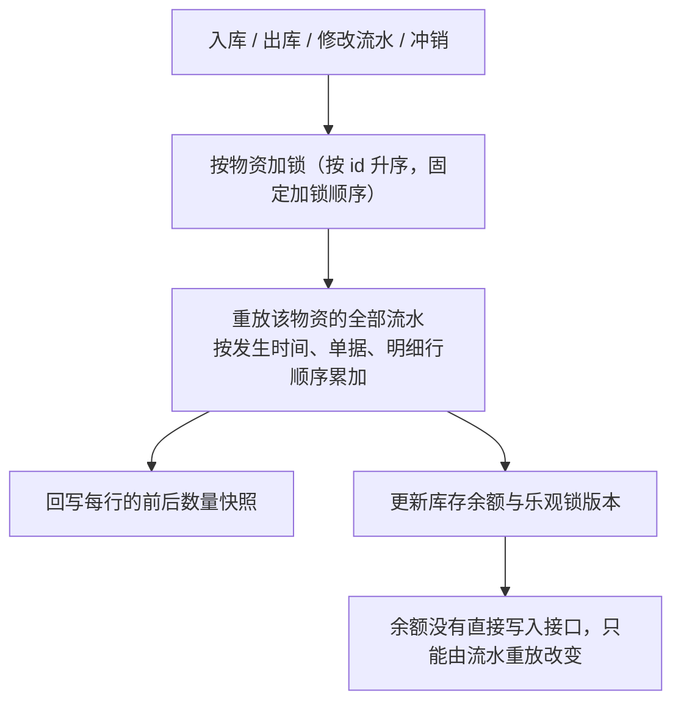

一张单据内同一物资只能有一行明细，数量必须为正，出入方向由单据头类型表达。

### 冲销

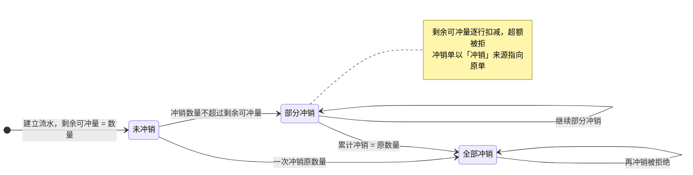

### 幂等与乐观锁

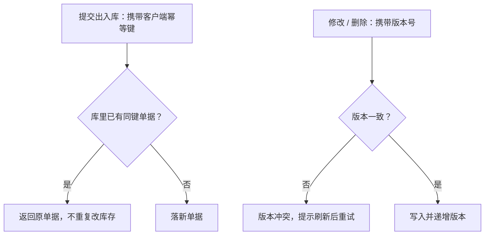

### 编号、编码与去重

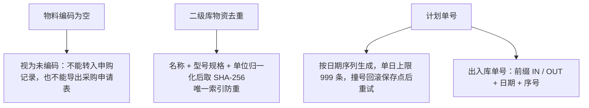

### 开关语义

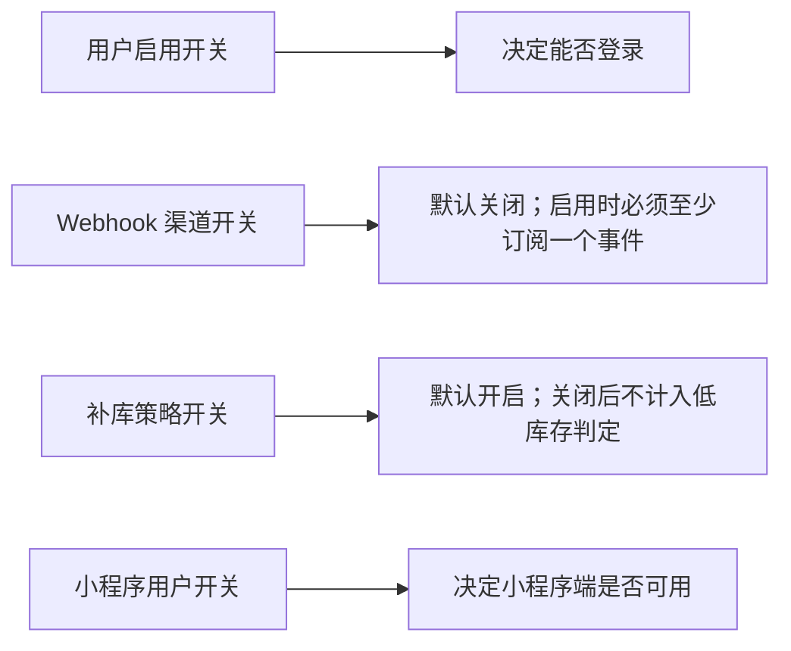

### 凭证加密与回显

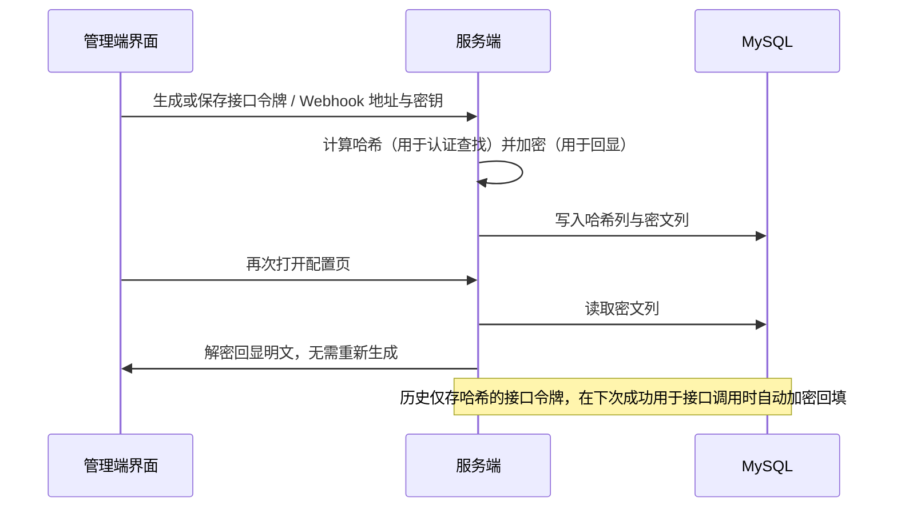

### 快照字段

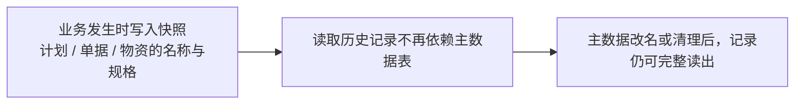

### 其它约定（参考表）

| 约定 | 说明 |
| --- | --- |
| JSON 列 | `system_setting.setting_value`、`webhook_channel.subscribed_events`、`webhook_delivery.payload`、`excel_import_job.result`、`excel_export_job.params` / `result`、`share_link.item_ids` / `columns`、`business_event_log.before_data` / `after_data` 为 MySQL `JSON` 类型，不建额外索引 |
| 默认值差异 | `memo.content` 在 `init.sql` 无 `DEFAULT`，ORM 侧另有 `default=""` / `server_default=""`；`file_object.mime_type` 同样只在 ORM 侧有 `default="image/png"`（`test_init_sql.py` 不校验默认值） |
| DDL 导入与变更 | `init.sql` 不创建数据库与账号、不由业务容器自动执行，需部署方手工导入，导入期间临时 `SET FOREIGN_KEY_CHECKS = 0`；当前不存在增量迁移脚本、软删除列、`updated_by` 列与数据库分区/视图，表结构变更必须同时改 `init.sql` 与 ORM 模型 |

### 种子数据
`init.sql` 末尾有两段 `INSERT`：先插入 `hazard_type` 隐患类型字典，再插入 `user` 表 6 个初始账号。

#### 隐患类型字典

`hazard_type` 预置 **157 条「大类 + 小类」组合、共 16 个大类**（源自车间原有隐患系统的类型清单），使新库导入后隐患登记页的「隐患类型」下拉即可用，无需先人工录入。语句按 `(major, minor)` 唯一键幂等，重复导入不会产生重复行：

| 大类 | 条数 | 大类 | 条数 |
| --- | --- | --- | --- |
| 高风险作业安全 | 17 | 人的不安全行为 | 17 |
| 电气安全 | 16 | 生产设备设施安全 | 11 |
| 建设施工安全 | 11 | 其他管理缺陷 | 11 |
| 环保 | 11 | 消防安全 | 10 |
| 交通安全 | 8 | 作业环境因素 | 8 |
| 危险化学品安全 | 8 | 安全警示和安全标识 | 8 |
| 特种设备安全 | 7 | 文明施工 | 5 |
| 现场5S | 5 | 个人防护用品 | 4 |

#### 初始账号

`user` 表插入 6 个初始账号（口令哈希相同，默认密码 123456，重复导入不会重置已有账号密码，语句带 `ON DUPLICATE KEY UPDATE display_name/role/enabled`）：

| `username` | `display_name` | `role` | `enabled` | `api_token_hash` |
| --- | --- | --- | --- | --- |
| `admin` | 系统管理员 | `SUPER_ADMIN` | 1 | `SHA2(@admin_api_token, 256)` |
| `warehouse` | 仓库管理员 | `WAREHOUSE_ADMIN` | 1 | `SHA2(@warehouse_api_token, 256)` |
| `purchase` | 申购管理员 | `PURCHASE_ADMIN` | 1 | `SHA2(@purchase_api_token, 256)` |
| `hazard` | 隐患管理员 | `HAZARD_ADMIN` | 1 | `SHA2(@hazard_api_token, 256)` |
| `ledger` | 台账管理员 | `LEDGER_ADMIN` | 1 | `SHA2(@ledger_api_token, 256)` |
| `readonly` | 只读用户 | `READ_ONLY` | 1 | `SHA2(@readonly_api_token, 256)` |

六个接口令牌由 `RANDOM_BYTES` 生成的 UUID v4 形式字符串经 `SHA2(..., 256)` 计算后写入 `api_token_hash`；`api_token_enc` 未在种子语句中赋值，取默认空串，首次用令牌通过认证后被加密回写（`server/app/core/permissions.py`）。除 `hazard_type` 与 `user` 两表外，其余 35 张表当前不含种子数据（含责任单位字典表），由运行期接口或导入任务写入。

命名与约束由 `server/app/core/database.py` 的 `NAMING_CONVENTION` 统一下发，ORM 不必手写名字：

| ORM 写法 | 生成的约束名 | 对应 `init.sql` |
| --- | --- | --- |
| 主键 | `pk_%(table_name)s` | `PRIMARY KEY` |
| `UniqueConstraint(...)` | `uq_%(table_name)s_%(column_0_name)s` | `UNIQUE KEY`，如 `uq_stock_operation_line_operation_id` |
| `CheckConstraint(..., name="minimum_nonnegative")` | `ck_%(table_name)s_%(constraint_name)s` | `CHECK`，如 `ck_stock_replenishment_policy_minimum_nonnegative` |
| `Index(...)` / `mapped_column(..., index=True)` | `ix_%(column_0_label)s` | `INDEX` 行，名字一致 |
| `ForeignKey(..., ondelete="CASCADE")` | `fk_%(table_name)s_%(column_0_name)s_%(referred_table_name)s` | 对应 `ON DELETE`；未写 `ondelete` 则 `init.sql` 中同样没有该子句 |

`server/tests/test_init_sql.py::test_init_sql_matches_current_model_schema` 逐表比对上述内容。

相关页面：[状态机](/dev-state-machines)、[数据流](/dev-flows)、[架构设计](/dev-architecture)、[接口约定](/api-conventions)

</TabsContent>

</Tabs>
