# 数据流

按端到端链路说明数据怎么走：**入口 → 服务 → 表 → 事务与并发控制**。细节出自 `server/app/api/v1/`、`server/app/services/`、`server/app/core/` 与 `docs/references/database/init.sql`。

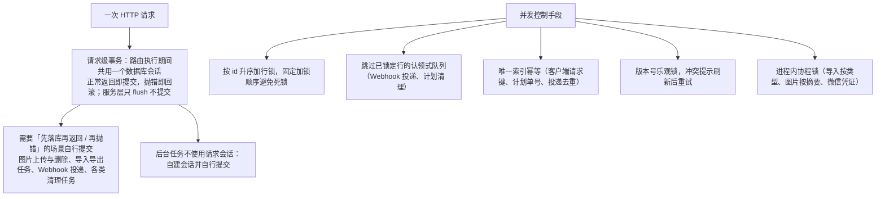
```mermaid
flowchart TD
    A["一次 HTTP 请求"] --> B["请求级事务：路由执行期间共用一个数据库会话<br/>正常返回即提交，抛错即回滚；服务层只 flush 不提交"]
    B --> C["需要「先落库再返回 / 再抛错」的场景自行提交<br/>图片上传与删除、导入导出任务、Webhook 投递、各类清理任务"]
    B --> D["后台任务不使用请求会话：自建会话并自行提交"]
    E["并发控制手段"] --> E1["按 id 升序加行锁，固定加锁顺序避免死锁"]
    E --> E2["跳过已锁定行的认领式队列（Webhook 投递、计划清理）"]
    E --> E3["唯一索引幂等（客户端请求键、计划单号、投递去重）"]
    E --> E4["版本号乐观锁，冲突提示刷新后重试"]
    E --> E5["进程内协程锁（导入按类型、图片按摘要、微信凭证）"]
```

<Tabs :tabs="[
  { id: 't0', title: '登录与认证' },
  { id: 't1', title: '库存与补库' },
  { id: 't2', title: '申购、任务与文件' },
  { id: 't3', title: '协作与外部集成' },
  { id: 't4', title: '其它链路索引' },
  { id: 't5', title: '隐患闭环' },
  { id: 't6', title: '台账维护' },
  { id: 't7', title: '工作管理' }
]">

<TabsContent id="t0">

### 管理端密码登录

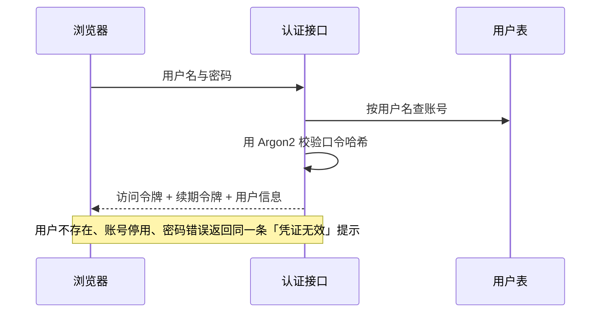
```mermaid
sequenceDiagram
    participant U as 浏览器
    participant API as 认证接口
    participant DB as 用户表
    U->>API: 用户名与密码
    API->>DB: 按用户名查账号
    API->>API: 用 Argon2 校验口令哈希
    API-->>U: 访问令牌 + 续期令牌 + 用户信息
    note over API,U: 用户不存在、账号停用、密码错误返回同一条「凭证无效」提示
```

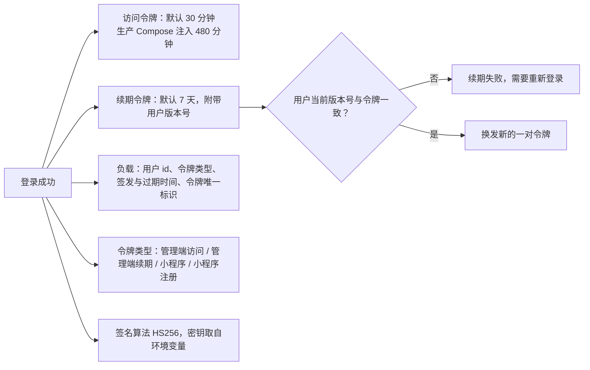
```mermaid
flowchart LR
    L["登录成功"] --> A["访问令牌：默认 30 分钟<br/>生产 Compose 注入 480 分钟"]
    L --> R["续期令牌：默认 7 天，附带用户版本号"]
    R --> V{"用户当前版本号与令牌一致？"}
    V -- "否" --> N["续期失败，需要重新登录"]
    V -- "是" --> A2["换发新的一对令牌"]
    L --> P["负载：用户 id、令牌类型、签发与过期时间、令牌唯一标识"]
    L --> T["令牌类型：管理端访问 / 管理端续期 / 小程序 / 小程序注册"]
    L --> S["签名算法 HS256，密钥取自环境变量"]
```

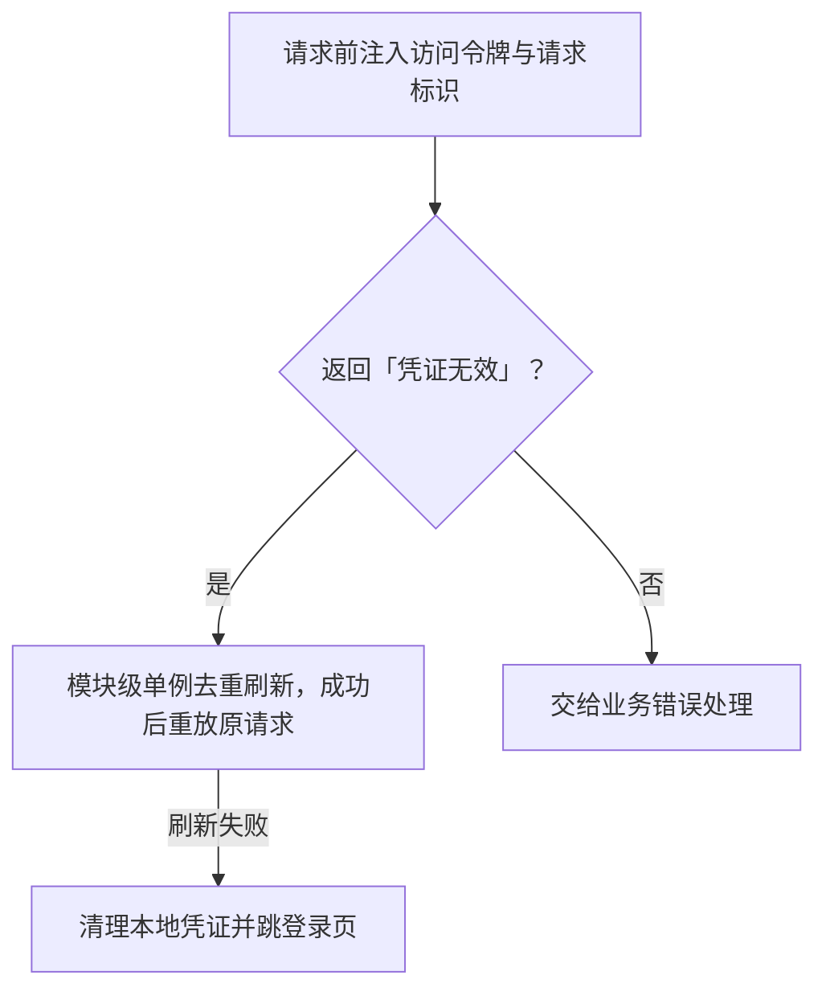
```mermaid
flowchart TD
    A["请求前注入访问令牌与请求标识"] --> B{"返回「凭证无效」？"}
    B -- "是" --> C["模块级单例去重刷新，成功后重放原请求"]
    B -- "否" --> D["交给业务错误处理"]
    C -- "刷新失败" --> E["清理本地凭证并跳登录页"]
```

### 接口令牌认证

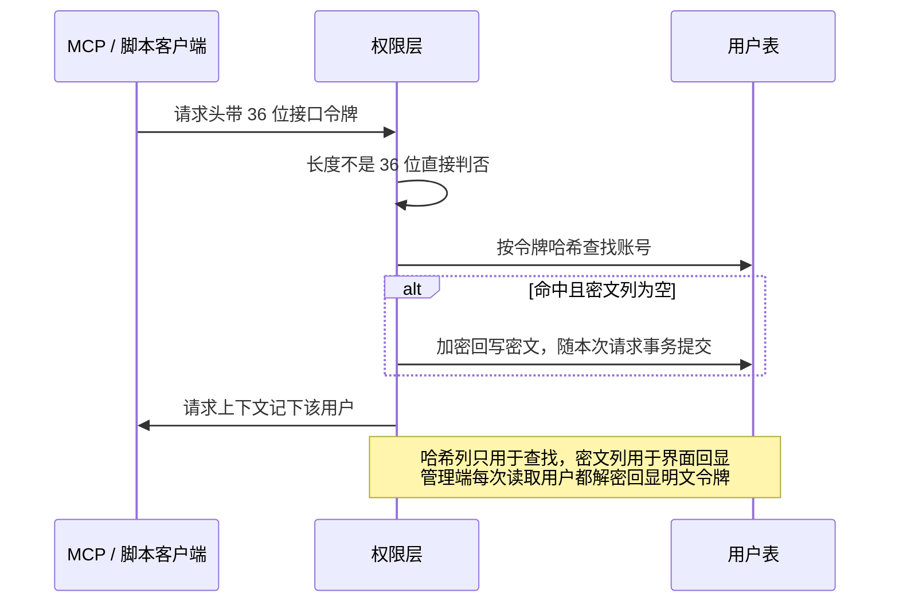
```mermaid
sequenceDiagram
    participant C as MCP / 脚本客户端
    participant P as 权限层
    participant DB as 用户表
    C->>P: 请求头带 36 位接口令牌
    P->>P: 长度不是 36 位直接判否
    P->>DB: 按令牌哈希查找账号
    alt 命中且密文列为空
        P->>DB: 加密回写密文，随本次请求事务提交
    end
    P->>C: 请求上下文记下该用户
    note over P,DB: 哈希列只用于查找，密文列用于界面回显<br/>管理端每次读取用户都解密回显明文令牌
```

有效令牌也可放进 Bearer 头（长度 36 位以内时先按接口令牌尝试）。令牌无效或用户停用分别返回凭证无效 / 账号停用。

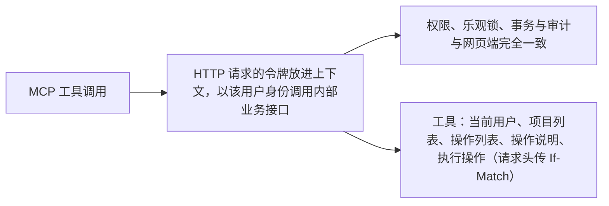
```mermaid
flowchart LR
    A["MCP 工具调用"] --> B["HTTP 请求的令牌放进上下文，以该用户身份调用内部业务接口"]
    B --> C["权限、乐观锁、事务与审计与网页端完全一致"]
    B --> D["工具：当前用户、项目列表、操作列表、操作说明、执行操作（请求头传 If-Match）"]
```

### 微信小程序登录与建档

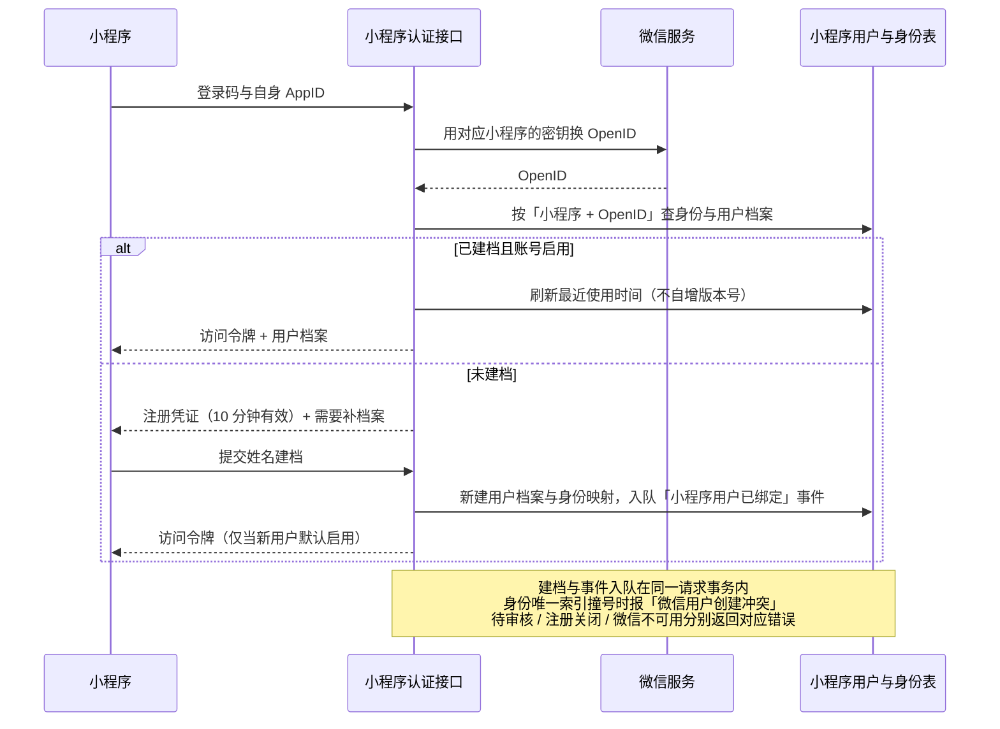
```mermaid
sequenceDiagram
    participant MP as 小程序
    participant API as 小程序认证接口
    participant WX as 微信服务
    participant DB as 小程序用户与身份表
    MP->>API: 登录码与自身 AppID
    API->>WX: 用对应小程序的密钥换 OpenID
    WX-->>API: OpenID
    API->>DB: 按「小程序 + OpenID」查身份与用户档案
    alt 已建档且账号启用
        API->>DB: 刷新最近使用时间（不自增版本号）
        API-->>MP: 访问令牌 + 用户档案
    else 未建档
        API-->>MP: 注册凭证（10 分钟有效）+ 需要补档案
        MP->>API: 提交姓名建档
        API->>DB: 新建用户档案与身份映射，入队「小程序用户已绑定」事件
        API-->>MP: 访问令牌（仅当新用户默认启用）
    end
    note over API,DB: 建档与事件入队在同一请求事务内<br/>身份唯一索引撞号时报「微信用户创建冲突」<br/>待审核 / 注册关闭 / 微信不可用分别返回对应错误
```

每次静默登录都刷新「最近使用时间」但**刻意不递增版本号**，否则用户每次打开小程序都会让管理端的乐观锁版本失效。

</TabsContent>

<TabsContent id="t1">

### 入库与出库

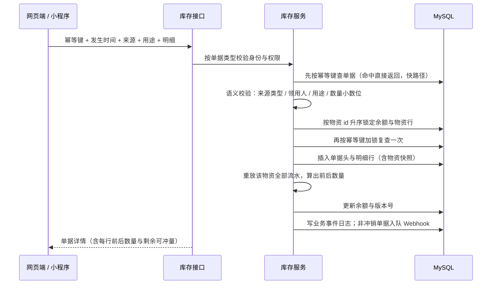
```mermaid
sequenceDiagram
    participant W as 网页端 / 小程序
    participant API as 库存接口
    participant S as 库存服务
    participant DB as MySQL
    W->>API: 幂等键 + 发生时间 + 来源 + 用途 + 明细
    API->>S: 按单据类型校验身份与权限
    S->>DB: 先按幂等键查单据（命中直接返回，快路径）
    S->>S: 语义校验：来源类型 / 领用人 / 用途 / 数量小数位
    S->>DB: 按物资 id 升序锁定余额与物资行
    S->>DB: 再按幂等键加锁复查一次
    S->>DB: 插入单据头与明细行（含物资快照）
    S->>S: 重放该物资全部流水，算出前后数量
    S->>DB: 更新余额与版本号
    S->>DB: 写业务事件日志；非冲销单据入队 Webhook
    API-->>W: 单据详情（含每行前后数量与剩余可冲量）
```

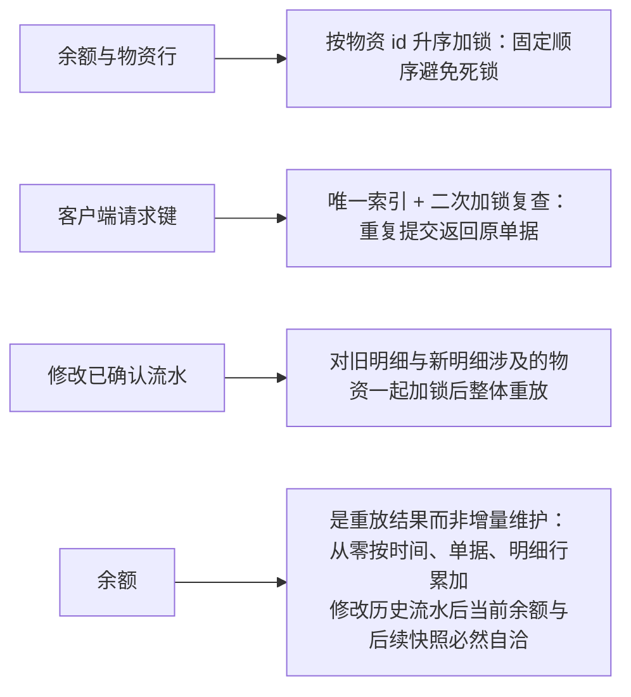
```mermaid
flowchart LR
    A["余额与物资行"] --> B["按物资 id 升序加锁：固定顺序避免死锁"]
    C["客户端请求键"] --> D["唯一索引 + 二次加锁复查：重复提交返回原单据"]
    E["修改已确认流水"] --> F["对旧明细与新明细涉及的物资一起加锁后整体重放"]
    G["余额"] --> H["是重放结果而非增量维护：从零按时间、单据、明细行累加<br/>修改历史流水后当前余额与后续快照必然自洽"]
```

数量最多 1 位小数，出库不校验余额是否充足（可以出现负库存）；单据号前缀区分入库与出库。

网页端与小程序对这类带幂等键的提交都会做弱网自动重试（见[架构设计](/dev-architecture)的「弱网自动重试」）：重发复用同一个请求键，服务端的幂等键复查保证不会重复入账。

### 冲销

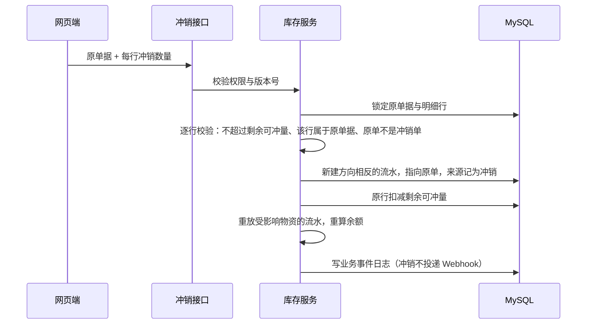
```mermaid
sequenceDiagram
    participant U as 网页端
    participant API as 冲销接口
    participant S as 库存服务
    participant DB as MySQL
    U->>API: 原单据 + 每行冲销数量
    API->>S: 校验权限与版本号
    S->>DB: 锁定原单据与明细行
    S->>S: 逐行校验：不超过剩余可冲量、该行属于原单据、原单不是冲销单
    S->>DB: 新建方向相反的流水，指向原单，来源记为冲销
    S->>DB: 原行扣减剩余可冲量
    S->>S: 重放受影响物资的流水，重算余额
    S->>DB: 写业务事件日志（冲销不投递 Webhook）
```

发生时间取「当前时间」与「原流水时间加 1 微秒」中较晚者；子项号继承原流水，领用人与领用单位强制为空。

### 低库存与补库

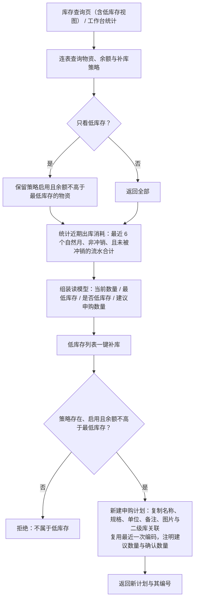
```mermaid
flowchart TD
    A["库存查询页（含低库存视图） / 工作台统计"] --> B["连表查询物资、余额与补库策略"]
    B --> C{"只看低库存？"}
    C -- "是" --> D["保留策略启用且余额不高于最低库存的物资"]
    C -- "否" --> E["返回全部"]
    D --> F["统计近期出库消耗：最近 6 个自然月、非冲销、且未被冲销的流水合计"]
    E --> F
    F --> G["组装读模型：当前数量 / 最低库存 / 是否低库存 / 建议申购数量"]
    G --> H["低库存列表一键补库"]
    H --> I{"策略存在、启用且余额不高于最低库存？"}
    I -- "否" --> J["拒绝：不属于低库存"]
    I -- "是" --> K["新建申购计划：复制名称、规格、单位、备注、图片与二级库关联<br/>复用最近一次编码，注明建议数量与确认数量"]
    K --> L["返回新计划与其编号"]
```

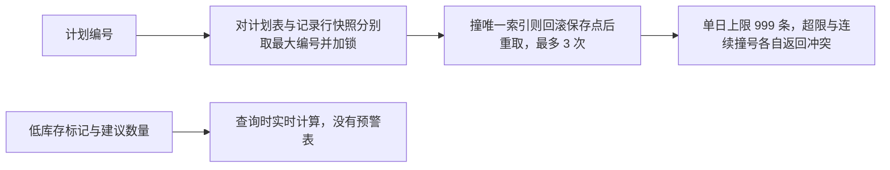
```mermaid
flowchart LR
    A["计划编号"] --> B["对计划表与记录行快照分别取最大编号并加锁"]
    B --> C["撞唯一索引则回滚保存点后重取，最多 3 次"]
    C --> D["单日上限 999 条，超限与连续撞号各自返回冲突"]
    E["低库存标记与建议数量"] --> F["查询时实时计算，没有预警表"]
```

补库只新增申购计划，不创建申购记录；需求日期取上海当天，采购负责人预填最近一条有值的记录（实际需求人仍为空，需要时手工填写）。

</TabsContent>

<TabsContent id="t2">

### 申购计划 → 申购记录 → 到货入库

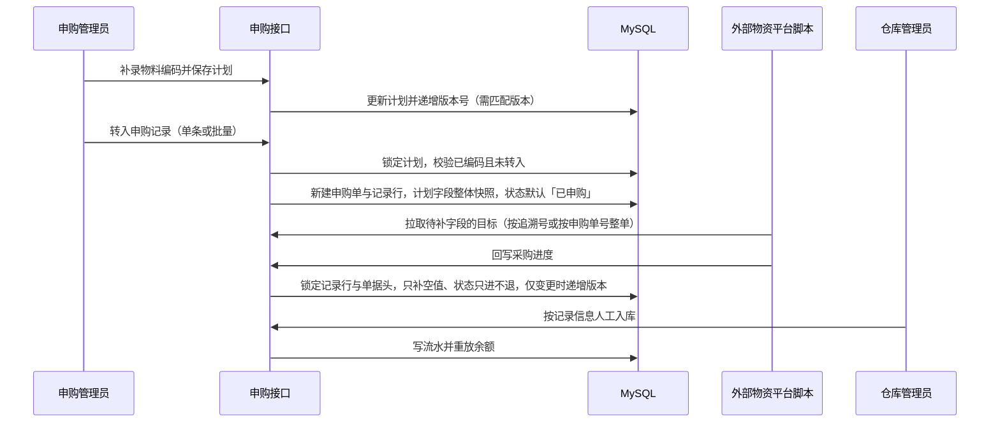
```mermaid
sequenceDiagram
    participant P as 申购管理员
    participant API as 申购接口
    participant DB as MySQL
    participant X as 外部物资平台脚本
    participant W as 仓库管理员
    P->>API: 补录物料编码并保存计划
    API->>DB: 更新计划并递增版本号（需匹配版本）
    P->>API: 转入申购记录（单条或批量）
    API->>DB: 锁定计划，校验已编码且未转入
    API->>DB: 新建申购单与记录行，计划字段整体快照，状态默认「已申购」
    X->>API: 拉取待补字段的目标（按追溯号或按申购单号整单）
    X->>API: 回写采购进度
    API->>DB: 锁定记录行与单据头，只补空值、状态只进不退，仅变更时递增版本
    W->>API: 按记录信息人工入库
    API->>DB: 写流水并重放余额
```

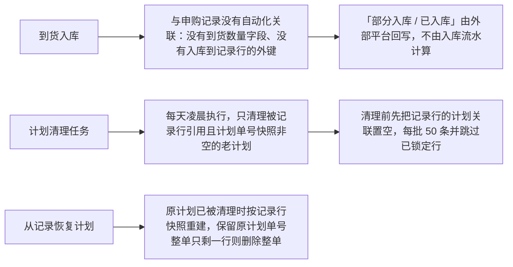
```mermaid
flowchart LR
    A["到货入库"] --> B["与申购记录没有自动化关联：没有到货数量字段、没有入库到记录行的外键"]
    B --> C["「部分入库 / 已入库」由外部平台回写，不由入库流水计算"]
    D["计划清理任务"] --> E["每天凌晨执行，只清理被记录行引用且计划单号快照非空的老计划"]
    E --> F["清理前先把记录行的计划关联置空，每批 50 条并跳过已锁定行"]
    G["从记录恢复计划"] --> H["原计划已被清理时按记录行快照重建，保留原计划单号<br/>整单只剩一行则删除整单"]
```

### Excel 导入

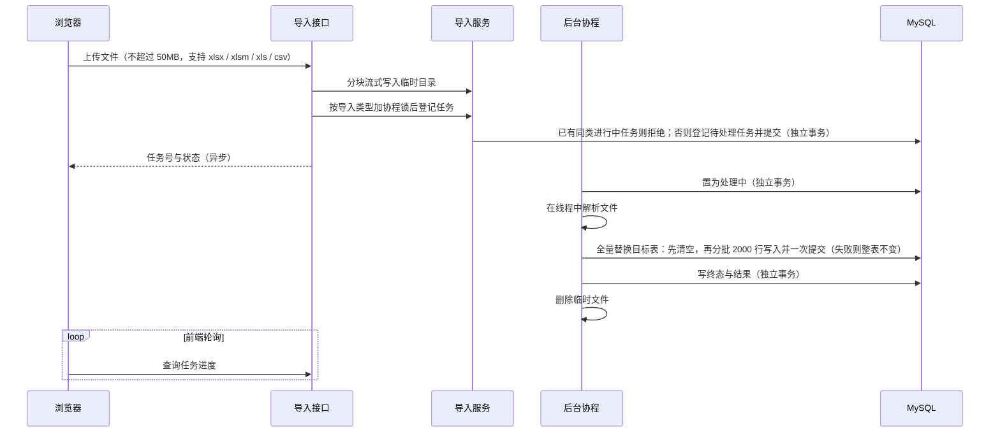
```mermaid
sequenceDiagram
    participant U as 浏览器
    participant API as 导入接口
    participant S as 导入服务
    participant BG as 后台协程
    participant DB as MySQL
    U->>API: 上传文件（不超过 50MB，支持 xlsx / xlsm / xls / csv）
    API->>S: 分块流式写入临时目录
    API->>S: 按导入类型加协程锁后登记任务
    S->>DB: 已有同类进行中任务则拒绝；否则登记待处理任务并提交（独立事务）
    API-->>U: 任务号与状态（异步）
    BG->>DB: 置为处理中（独立事务）
    BG->>BG: 在线程中解析文件
    BG->>DB: 全量替换目标表：先清空，再分批 2000 行写入并一次提交（失败则整表不变）
    BG->>DB: 写终态与结果（独立事务）
    BG->>BG: 删除临时文件
    loop 前端轮询
        U->>API: 查询任务进度
    end
```

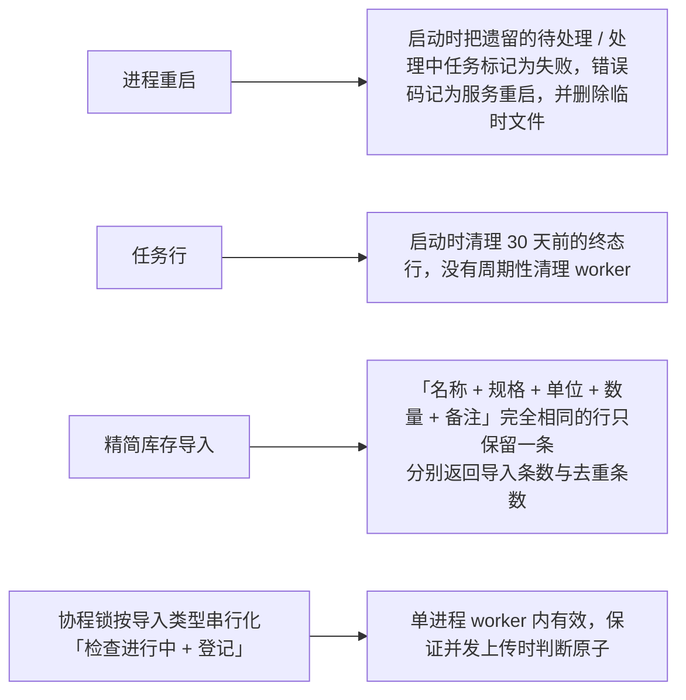
```mermaid
flowchart LR
    A["进程重启"] --> B["启动时把遗留的待处理 / 处理中任务标记为失败，错误码记为服务重启，并删除临时文件"]
    C["任务行"] --> D["启动时清理 30 天前的终态行，没有周期性清理 worker"]
    E["精简库存导入"] --> F["「名称 + 规格 + 单位 + 数量 + 备注」完全相同的行只保留一条<br/>分别返回导入条数与去重条数"]
    G["协程锁按导入类型串行化「检查进行中 + 登记」"] --> H["单进程 worker 内有效，保证并发上传时判断原子"]
```

### Excel 导出

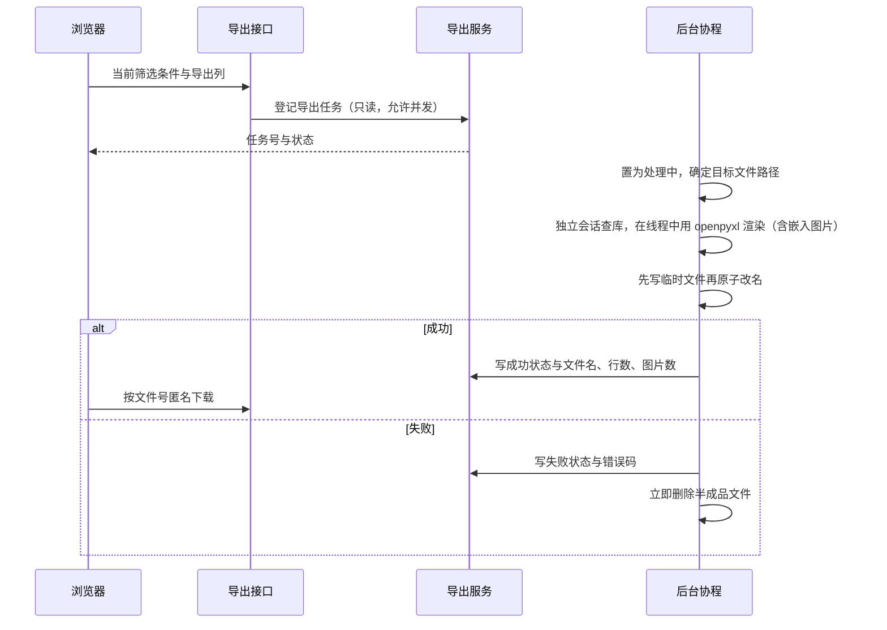
```mermaid
sequenceDiagram
    participant U as 浏览器
    participant API as 导出接口
    participant S as 导出服务
    participant BG as 后台协程
    U->>API: 当前筛选条件与导出列
    API->>S: 登记导出任务（只读，允许并发）
    S-->>U: 任务号与状态
    BG->>BG: 置为处理中，确定目标文件路径
    BG->>BG: 独立会话查库，在线程中用 openpyxl 渲染（含嵌入图片）
    BG->>BG: 先写临时文件再原子改名
    alt 成功
        BG->>S: 写成功状态与文件名、行数、图片数
        U->>API: 按文件号匿名下载
    else 失败
        BG->>S: 写失败状态与错误码
        BG->>BG: 立即删除半成品文件
    end
```

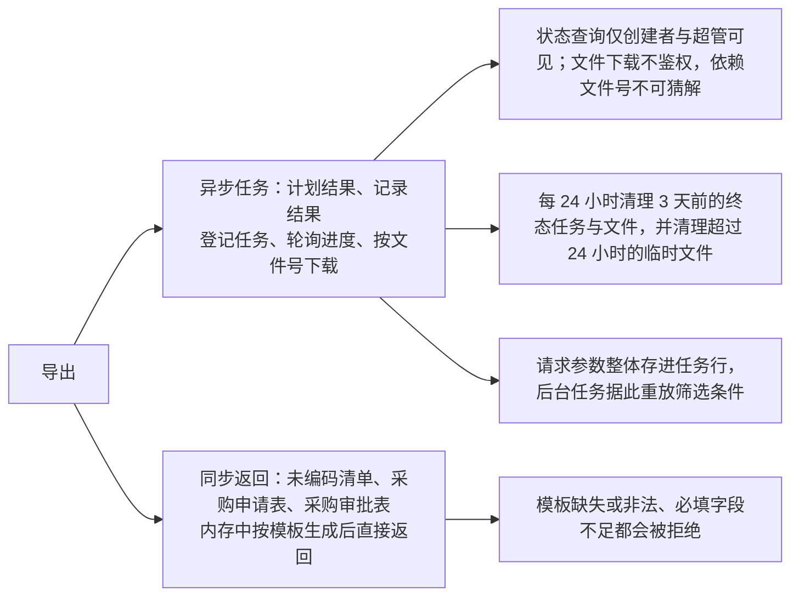
```mermaid
flowchart LR
    A["导出"] --> B["异步任务：计划结果、记录结果<br/>登记任务、轮询进度、按文件号下载"]
    A --> C["同步返回：未编码清单、采购申请表、采购审批表<br/>内存中按模板生成后直接返回"]
    C --> D["模板缺失或非法、必填字段不足都会被拒绝"]
    B --> E["状态查询仅创建者与超管可见；文件下载不鉴权，依赖文件号不可猜解"]
    B --> F["每 24 小时清理 3 天前的终态任务与文件，并清理超过 24 小时的临时文件"]
    B --> G["请求参数整体存进任务行，后台任务据此重放筛选条件"]
```

### 图片上传与读取

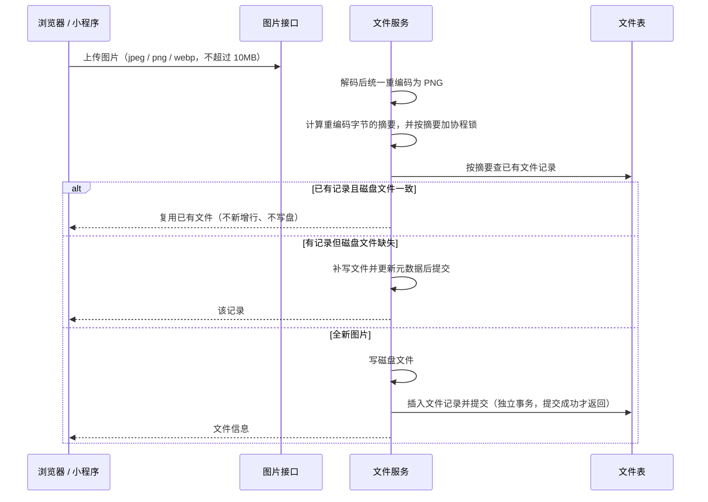
```mermaid
sequenceDiagram
    participant U as 浏览器 / 小程序
    participant API as 图片接口
    participant FS as 文件服务
    participant DB as 文件表
    U->>API: 上传图片（jpeg / png / webp，不超过 10MB）
    FS->>FS: 解码后统一重编码为 PNG
    FS->>FS: 计算重编码字节的摘要，并按摘要加协程锁
    FS->>DB: 按摘要查已有文件记录
    alt 已有记录且磁盘文件一致
        FS-->>U: 复用已有文件（不新增行、不写盘）
    else 有记录但磁盘文件缺失
        FS->>FS: 补写文件并更新元数据后提交
        FS-->>U: 该记录
    else 全新图片
        FS->>FS: 写磁盘文件
        FS->>DB: 插入文件记录并提交（独立事务，提交成功才返回）
        FS-->>U: 文件信息
    end
```

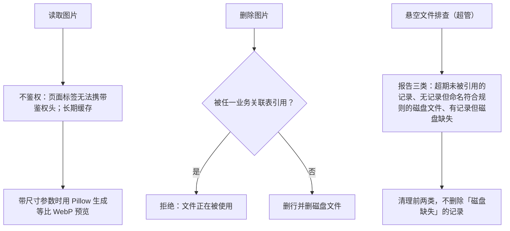
```mermaid
flowchart TD
    A["读取图片"] --> B["不鉴权：页面标签无法携带鉴权头；长期缓存"]
    B --> C["带尺寸参数时用 Pillow 生成等比 WebP 预览"]
    D["删除图片"] --> E{"被任一业务关联表引用？"}
    E -- "是" --> F["拒绝：文件正在被使用"]
    E -- "否" --> G["删行并删磁盘文件"]
    H["悬空文件排查（超管）"] --> I["报告三类：超期未被引用的记录、无记录但命名符合规则的磁盘文件、有记录但磁盘缺失"]
    I --> J["清理前两类，不删除「磁盘缺失」的记录"]
```

图片地址由文件标识推导，不持久化域名或路径：前端用图片加速配置或构建变量拼接，预览地址追加尺寸参数。

读取图片响应缓存 1 天、共享缓存 30 天；上传先拿到文件标识，再随业务表单一起提交给计划 / 物资接口；磁盘目录由环境变量指定（默认 `server/data/uploads`），文件名即文件标识。

</TabsContent>

<TabsContent id="t3">

### 链接分享公开页

```mermaid
sequenceDiagram
    participant U as 登录用户
    participant API as 分享接口
    participant DB as 分享表
    participant V as 访客（未登录）
    U->>API: 创建分享：类型、条目、有效期、展示列
    API->>DB: 校验勾选项存在，写入分享记录（不可猜解的标识 + 到期时间）
    API-->>U: 分享标识与到期时间
    V->>API: 打开分享页（不鉴权）
    API->>DB: 按标识查分享记录并校验未过期
    API->>DB: 按创建时勾选的条目实时读取计划 / 记录行，保持创建时顺序
    API-->>V: 仅展示列 + 行标识 + 数量单位（隐藏列不下发）
```

```mermaid
flowchart LR
    A["展示列留空"] --> B["默认列：该类型全部列去掉「状态」"]
    C["修改列或撤销"] --> D["仅创建者或超管；列名非法被拒绝"]
    E["撤回"] --> F["物理删除记录，匿名读取立即失败"]
    G["启动时与每日清理"] --> H["删除已过期的分享记录"]
    I["公开路由"] --> J["不要求登录；展示列与顺序取自创建时的勾选"]
```

### 采购记录同步（外部平台回写）

```mermaid
sequenceDiagram
    participant X as 外部平台脚本
    participant API as 同步接口
    participant DB as MySQL
    X->>API: 拉取待补字段的目标（游标分页 + 字段白名单）
    API->>DB: 按追溯号或申购单号统计仍待补字段的记录行
    API-->>X: 目标列表与下一页游标
    X->>X: 脚本侧按申购单或追溯号聚合后查询外部平台
    X->>API: 回写采购进度
    API->>DB: 锁定命中行与其单据头
    API->>DB: 文本仅当空才填、日期仅当空才填、状态只进不退，仅变更时递增版本
    API-->>X: 变更的单据数与行数（整单回写另返回命中与未命中数）
```

可回写的字段是固定白名单：业务员、合同号、船号、集港港口与集港日期、发船日期、合同签订日期、状态；未知字段被拒绝。全部端点（含只读）都要求申购写权限；整单回写中某个追溯号不存在时只计入未命中并继续处理其余项。

### Webhook 投递

```mermaid
sequenceDiagram
    participant B as 业务事务（出入库、小程序建档）
    participant Q as 投递队列表
    participant W as 投递 worker（每 2 秒）
    participant P as 飞书 / 钉钉
    B->>Q: 按「启用渠道 ∩ 订阅事件」插入待投递行（复用业务事务）
    W->>Q: 认领一条：到期或租约超时的行，跳过已锁定行
    W->>Q: 置为投递中并递增尝试次数（独立事务）
    W->>P: 推送消息（带时间戳与签名）
    alt 平台返回成功
        W->>Q: 置为成功，记录响应状态与时间
    else 失败
        W->>Q: 未满 5 次则按退避时间重排，第 5 次置为失败并记录原因
    end
```

```mermaid
flowchart LR
    A["可订阅事件"] --> A1["出库已创建、入库已创建、小程序用户已绑定"]
    B["渠道配置"] --> B1["地址与密钥加密入库，读取解密回显"]
    B --> B2["地址须为该平台的 https 域名与路径，否则拒绝"]
    C["退避"] --> C1["1 / 5 / 15 / 60 / 180 分钟，最多 5 次"]
    E["投递行"] --> E1["同一事件 + 同一渠道唯一，重复入队被去重"]
    D["发送超时"] --> D1["响应 8 秒、连接 3 秒"]
```

### AI 搜索

```mermaid
flowchart TD
    A["业务查询带「AI 扩词」参数"] --> B["非严格扩词：失败不影响结果"]
    B --> C{"配置存在、已启用且有密钥？"}
    C -- "否" --> D["原样返回关键词，不报错"]
    C -- "是" --> E{"缓存命中？（键 = 配置版本 + 关键词，30 分钟，上限 1000 条）"}
    E -- "是" --> F["返回缓存的同义词 / 近义词组"]
    E -- "否" --> G["调用上游模型（响应 10 秒、连接 3 秒超时）"]
    G --> H{"上游返回"}
    H -- "成功" --> I["解析 JSON，每组最多 6 个扩展词，用竖线连接"]
    H -- "失败" --> J["非严格模式记警告并回退原关键词<br/>显式扩词接口则抛上游错误"]
    I --> K["写缓存"]
    K --> L["作为 OR 关键词交给查询层"]
```

```mermaid
flowchart LR
    A["配置写入"] --> B["请求级事务 + 版本号乐观锁，冲突提示刷新"]
    C["密钥"] --> D["Fernet 加密入库，读取解密回显；解密失败返回服务不可用"]
    E["缓存"] --> F["进程内字典 + 单一 HTTP 客户端；多实例部署时缓存不共享"]
    E --> F2["配置存在系统设置表，变更同时写事件日志（记录前后配置）"]
    G["搜索语义"] --> H["同一参数内多词是 OR，不同参数之间是 AND"]
```

显式扩词接口在未配置时返回「AI 未配置」，上游超时等错误按上游错误码透出。

</TabsContent>

<TabsContent id="t4">

### 其它链路索引

| 链路 | 触发 | 主要表 |
| --- | --- | --- |
| 二级库物资建档与安全库存 | 物资表单保存、安全库存设置 | `stock_material`、`stock_material_image`、`stock_balance`、`stock_replenishment_policy` |
| 周期性计划一键生成 | 模板一键生成 | `purchase_plan_template`（读） → `purchase_material`（写，计划日期取生成当天） |
| 小程序扫码与出库 | 扫物资码、库存查询、扫码出库 | `stock_material`、`stock_balance`、`stock_operation(_line)` |
| 小程序码生成 | 物资详情生成小程序码（重定向到带物资标识的入口） | 无（微信接口 + 内存缓存） |
| 物料编码存在性校验 | 计划补录编码时校验 | `material_code_library` |
| 隐患登记与整改闭环 | 网页端登记/编辑、小程序登记与整改跟进 | `hazard`、`hazard_before_image`、`hazard_after_image`（字典表 `hazard_unit`、`hazard_type`） |
| 台账登记与标签维护 | 标签管理页维护标签树、台账总览页新增/编辑台账记录 | `ledger`、`ledger_image`、`ledger_tag`、`ledger_tag_image` |
| 小程序台账查看 | 小程序台账列表搜索/分页、点开详情看用途与标签 | `ledger`（读）、`ledger_tag`（读，拼标签路径）、`file_object`（读图片） |
| 工作管理 | 任务视图维护任务与工作记录、工作总览 / 人员视图按区间查询 | `work_task`、`work_task_image`、`work_record` |
| 备忘录 | 备忘录增删改查 | `memo`（草稿与字号存浏览器本地） |
| 版本信息 | 查询版本（公开） | 无（读构建期注入的构建时间与提交号） |

字段级细节见[数据模型](/dev-data-model)，状态迁移与错误码见[状态机](/dev-state-machines)，分层与配置见[架构设计](/dev-architecture)。

</TabsContent>

<TabsContent id="t5">

### 隐患登记与整改闭环

```mermaid
sequenceDiagram
    participant M as 小程序 / 网页端
    participant S as 服务端
    participant DB as MySQL
    M->>S: 登记隐患（小程序带 client_request_id）
    S->>DB: 查幂等键；命中则直接返回原隐患
    S->>DB: 按责任单位取责任人快照；要求完成时间缺省 = 检查日期 + 7 天
    S->>DB: 写 hazard + 整改前图片关联
    M->>S: 跟进整改（status / 整改员工 / 备注 / 整改后图片，带 version）
    S->>S: 校验 version（不符 → VERSION_CONFLICT，提示刷新）
    S->>DB: 更新 hazard、整表替换整改后图片关联
    M->>S: 隐患列表（关键字匹配区域与描述，可按状态/整改员工筛选）
    S-->>M: 分页结果 + 工作台统计（待整改/整改受阻/已整改/逾期）
```

要点：

| 项 | 说明 |
| --- | --- |
| 责任人快照 | 登记时从责任单位带出写入 `hazard.person`；之后单位换人不回写历史隐患，只有换单位才重新快照 |
| 幂等 | 小程序登记用 `client_request_id` 唯一索引防重复；网页端登记不传该键 |
| 乐观锁 | 隐患更新带 `version`，两端共用同一套校验；删除走 `If-Match` 头 |
| 逾期口径 | `due_date` 早于今天且状态不是「已整改」；今天到期不算逾期，工作台卡片与列表标记同一口径 |
| 字典引用保护 | 责任单位、隐患类型被隐患引用时不可删除（409），未被引用则物理删除，名称与组合可复用 |
| 图片 | 整改前/后各一张关联表，与其它模块共用图片存储；附件管理的引用次数含这两张表，因此不会被判为悬空 |

</TabsContent>

<TabsContent id="t6">

### 台账登记与标签维护

```mermaid
sequenceDiagram
    participant W as 网页端
    participant S as 服务端
    participant DB as MySQL
    W->>S: 新增 / 编辑标签（名称、备注、图片、上级标签；编辑带 version）
    S->>S: 校验上级存在、改后子树不超过 3 层、未移入自身子孙，且同级名称唯一
    S->>DB: 写 ledger_tag（含 parent_id），并整表替换 ledger_tag_image 关联
    W->>S: 删除标签（If-Match）
    S->>S: 有子标签、或自身与子孙被台账记录引用 → 拒绝（409）
    W->>S: 标签列表（读模型回填 item_count）
    S->>DB: 按 ledger.tag_ids 逗号串统计每个标签被直接引用的条数（不含子孙）
    W->>S: 保存台账记录（name / model_spec / quantity / remark / tag_ids / image_ids）
    S->>S: 校验 tag_ids 全部存在（缺失 → INVALID_TAG_ID），去重后升序
    S->>DB: 写 ledger（tag_ids 存成 '3,12,15' 逗号串）并整表替换 ledger_image 关联
    W->>S: 台账列表（keyword / tag_ids / 分页）
    S->>S: 选中标签展开为「自身 + 全部子孙」，再按逗号串逐 id 匹配
    S-->>W: 分页结果，标签回填名称与完整层级路径
```

要点：

| 项 | 说明 |
| --- | --- |
| 标签层级 | 至多 3 层：在已到第 3 层的节点下新增子标签直接拒绝（`LEDGER_TAG_MAX_LEVEL`）；层级由祖先链实时算出，不落库 |
| 改上级 | 标签可以改上级：`PATCH` 带 `parent_id`——传具体 id 换父节点，传 `null` 移为一级标签，**不传该字段表示不动层级**（只改名称 / 备注 / 图片的调用照旧）。改后整棵子树重新计入层级：「会超过 3 层」与「移到自己子孙下（成环）」都被 `LEDGER_TAG_MAX_LEVEL` 拒绝（400），同级重名按**落库后的父节点**判断（`DUPLICATE_LEDGER_TAG`）。页面上的上级选择器把第 3 层节点与自身子树置灰，服务端仍会再校验一次 |
| 同级名称唯一 | 同一 `parent_id` 下名称唯一（`DUPLICATE_LEDGER_TAG`）；根节点的 `parent_id` 为 NULL，MySQL 唯一索引对 NULL 不去重，因此这条由服务端校验 |
| 删除保护 | 有子标签 → `LEDGER_TAG_HAS_CHILDREN`；自身或子孙被台账记录引用 → `LEDGER_TAG_IN_USE`（都按子树展开检查），均返回 409，未被引用则物理删除 |
| 标签使用数量 | 读接口回填 `item_count`：**直接**引用该标签的台账记录数（不含子标签的使用量，按 `ledger.tag_ids` 逗号串匹配统计，与删除保护的引用判定同口径），标签管理页把它作为节点上的数字徽标（含 0，含义放 tooltip） |
| 标签存储 | 台账记录的标签是 `ledger.tag_ids` 里的逗号分隔 id（写入时去重、升序规范化），没有关联表；写接口校验存在性，读接口回填标签名称与完整层级路径 |
| 标签筛选 | 列表按 `tag_ids` 筛选时展开为「选中标签 + 全部子孙」；选中的 id 一个都不存在时返回空结果，不当作「不限」（手改 URL 不会误返回全量） |
| 图片 | 标签图片与台账图片各一张关联表，与其它模块共用图片存储；附件管理的引用次数含这两张表，因此不会被判为悬空 |
| 并发 | 标签与台账记录的 PATCH 都带 `version`、DELETE 走 `If-Match`，冲突返回 `VERSION_CONFLICT` 提示刷新后重试 |

</TabsContent>

<TabsContent id="t7">

### 任务、工作记录与三个视图

```mermaid
sequenceDiagram
    participant W as 网页端（任务 / 人员视图）
    participant S as 服务端
    participant DB as MySQL
    W->>S: 新增 / 编辑任务（名称、状态、计划起止、工作内容、图片；编辑带 version）
    S->>S: 校验项目内名称唯一（DUPLICATE_WORK_TASK）与计划结束不早于开始
    S->>DB: 写 work_task，并整表替换 work_task_image 关联
    W->>S: 给任务排活（任务 + 起止日期 + 上午 / 下午 + 参与人员 + 备注）
    S->>S: 拆分参与人员（顿号 / 逗号 / 分号 / 空格）→ 去空、去重保序；校验任务存在与区间合法
    S->>DB: 写 work_record（participants 存「、」连接的姓名串）
    W->>S: 工作总览（日期区间 + 任务 / 参与人员 / 关键字 + 分页）
    S->>DB: 按区间重叠粗筛记录（start_date ≤ 区间末 且 end_date ≥ 区间首）
    S->>S: 每条记录按半日规则展开成 (日期, 时段) 行，再按参与人精确匹配、排序、分页
    S-->>W: 一行 = 日期 + 任务 + 时段（全天 / 上午 / 下午）+ 参与人员
    W->>S: 任务视图时间线（任务分页 + 每个任务在该区间内的记录）
    W->>S: 人员视图时间线（区间内记录按参与人姓名分组）
    S->>S: 拆分 participants 分组、按姓名关键字过滤、分页（前端再按拼音排序）
    S-->>W: 一行 = 参与人 + 区间内的记录列表（供半日格时间线绘制色块）
```

要点：

| 项 | 说明 |
| --- | --- |
| 人员不是实体 | 参与人员是 `work_record.participants` 里「、」连接的姓名串（一条记录最多 20 人、每人 ≤24 字），没有人员表；人员视图的人员清单 = 区间内记录里出现过的姓名去重，新姓名第一次录入即成为一行。表单下拉给项目内历史姓名辅助输入（`GET /work-participants`），错别字仍可能造出重名条目 |
| 半天语义 | 起止都精确到上午 / 下午，某天是否占用由 `work_service.occupied_halves` 一处判定：起始日之后全天、起始日只在上午档时占上午、结束日之前全天、结束日只在下午档时占下午；前端 `recordHalfKeys` 用同一口径算色块范围（两侧改动必须同步） |
| 区间必填且封顶 | 三个视图都要求 `start_date` / `end_date`，最长 92 天（`WORK_RANGE_TOO_LONG`）；总览按天展开、人员按姓名分组都在服务端过滤与分页（区间封顶后是车间量级的数据） |
| 参与人筛选 | 工作总览的 `participants` 按拆分后的姓名列表精确匹配（不是子串匹配）：「张三」不会命中「张三丰」 |
| 任务与记录的关系 | 任务名项目内唯一（同一件活反复干都挂同一个任务）；删任务前必须先删记录（409 `WORK_TASK_HAS_RECORDS`），不做级联删除 |
| 权限 | 读取对所有登录用户开放；写操作需要 `WorkWriter`（`SUPER_ADMIN` / `WORK_ADMIN`），任务图片上传走同一写角色（`FileWriter` 含 `WORK_ADMIN`） |
| 图片 | 任务图片一张关联表，与其它模块共用图片存储；附件管理的引用次数含这张表，因此不会被判为悬空 |
| 并发 | 任务与工作记录的 PATCH 都带 `version`、DELETE 走 `If-Match`，冲突返回 `VERSION_CONFLICT` 提示刷新后重试 |

</TabsContent>

</Tabs>
