# 状态机

枚举取值来自 `server/app/domain/enums.py`，流转规则来自 `server/app/services/` 与 `server/app/api/v1/`，错误码来自 `server/app/core/errors.py` 与各服务内抛出的业务错误。全部错误码见[错误码总表](/api-error-codes)。

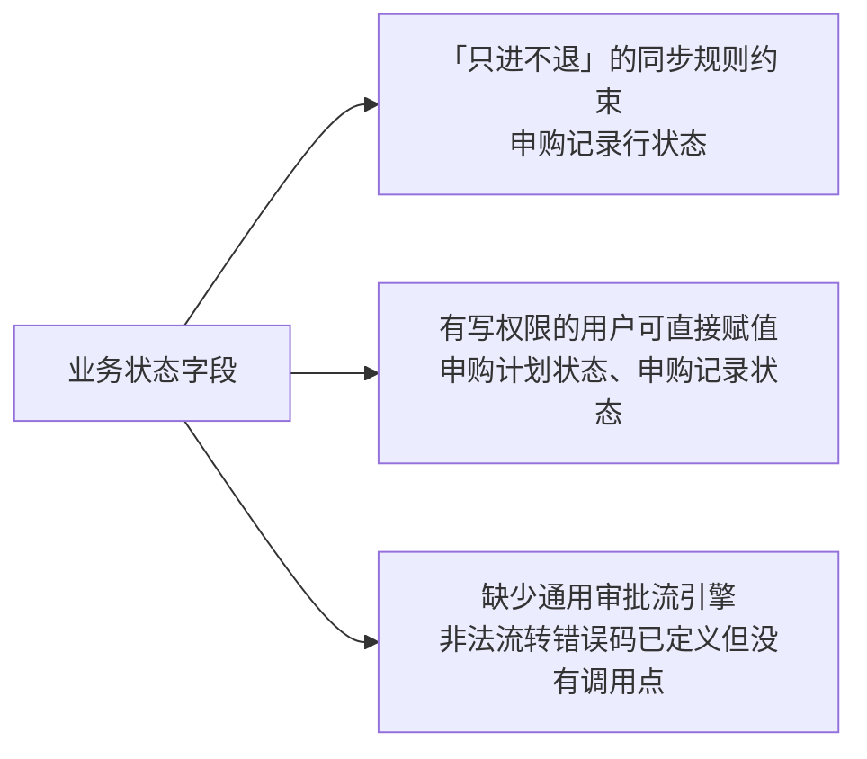

<Tabs :tabs="[
  { id: 't0', title: '枚举与申购计划' },
  { id: 't1', title: '库存流水与冲销' },
  { id: 't2', title: '异步任务与推送' },
  { id: 't3', title: '小程序与分享' }
]">

<TabsContent id="t0">

### 枚举总表

| 枚举 | 取值（代码/API 层） | 数据库存储 | 说明 |
| --- | --- | --- | --- |
| `Role` | `SUPER_ADMIN` / `WAREHOUSE_ADMIN` / `PURCHASE_ADMIN` / `READ_ONLY` | ENUM 同名 | 一个用户一个角色 |
| `OperationType` | `INBOUND` / `OUTBOUND` | ENUM 同名 | 流水类型 |
| `SourceType` | `MANUAL` / `MINI_PROGRAM` / `REVERSAL` / `INITIALIZATION` | ENUM 同名 | 来源类型；**无** `PURCHASE_RECEIPT` |
| `PurchasePlanStatus` | `正常` / `暂不申购` / `已归档` | ENUM `NORMAL` / `DEFERRED` / `ARCHIVED` | DB 存枚举名，API 返回中文值 |
| `MiniProgramCodeEnv` | `trial` / `release` | — | 小程序码环境 |
| `MiniProgramStockStatus` | `normal` / `out_of_stock` / `low_stock` | 计算得出，不落库 | 小程序库存标签 |
| `MiniProgramFeatureMode` | `disabled` / `query_only` / `read_write` | 存在 `system_setting.setting_value` JSON | 5 个小程序功能页各自一档 |
| `SecondaryWarehouseMode` | `full` / `lite` | 同上 | 二级库运行模式 |
| `WebhookPlatform` | `FEISHU` / `DINGTALK` | ENUM 同名 | 推送渠道 |
| `WebhookEventType` | `stock.outbound.created` / `stock.inbound.created` / `mini_program.user.bound` | `webhook_delivery.event_type` 存枚举**名**（`STOCK_OUTBOUND_CREATED` 等） | `webhook_channel.subscribed_events` JSON 存**值**（点号形式） |
| `WebhookDeliveryStatus` / `ExcelImportJobStatus` / `ExcelExportJobStatus` | 前者 `PENDING` / `SENDING` / `SUCCEEDED` / `FAILED`，后两者 `PENDING` / `RUNNING` / `SUCCEEDED` / `FAILED` | ENUM 同名 | 投递队列 / 异步任务 |
| `ShareType` | `purchase_plan` / `purchase_record` | ENUM 同名 | 分享数据类型 |
| `ShareExpiryOption` | `24h` / `3d` / `7d` / `30d` / `permanent` | 换算为 `share_link.expires_at`（`permanent` → `NULL`） | 前端选择码，不落库 |
| 申购记录状态 | 自由字符串（`VARCHAR(128)`，默认 `已申购`） | 原样存字符串 | 取值非枚举，筛选项由库中 `DISTINCT` 得出 |
| `urgency` / `category` | 自由字符串 | 原样字符串 | 前端候选：`正常/紧急/非常紧急`、`工具/消耗物资/备品备件` |

### 申购计划状态

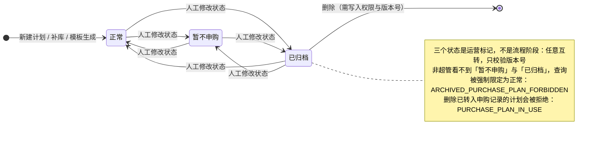

### 转入申购记录、清理与恢复

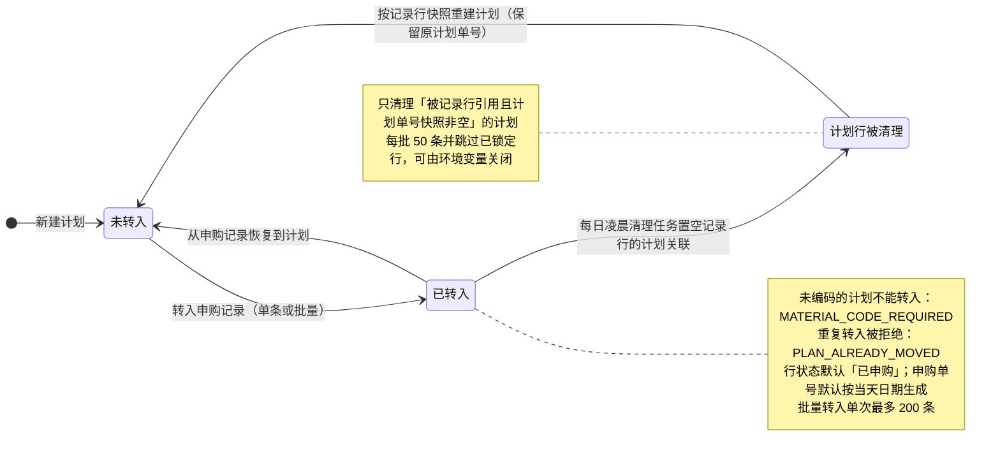

### 申购记录行状态（只进不退）

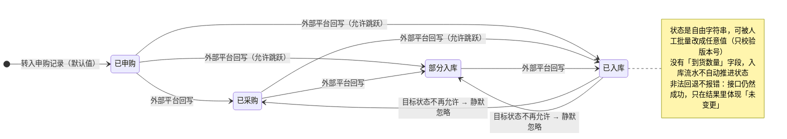

### 外部平台回写规则

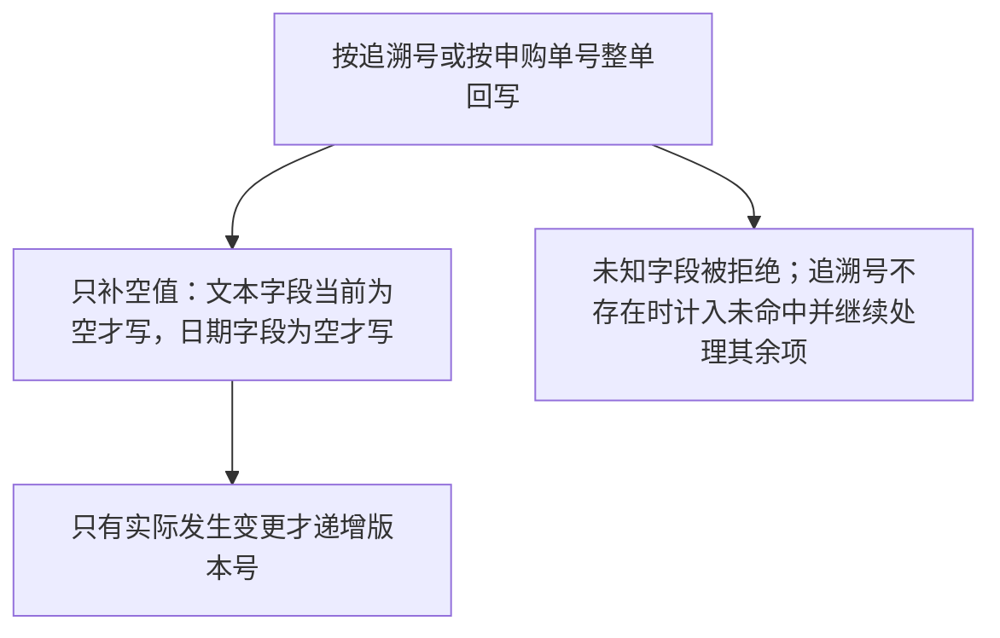

</TabsContent>

<TabsContent id="t1">

### 类型与来源的合法组合

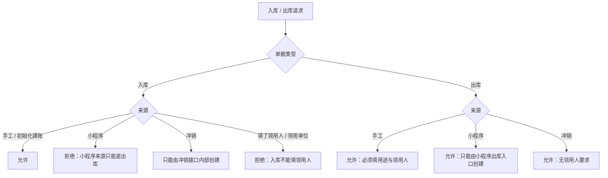


### 客户端请求键的幂等

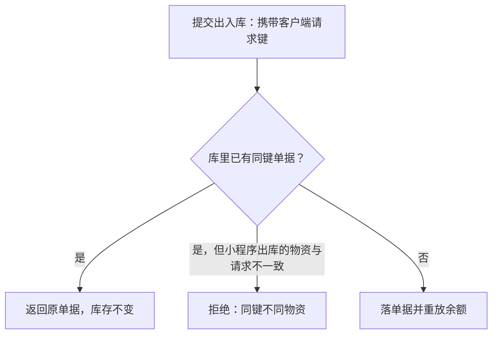

### 冲销生命周期

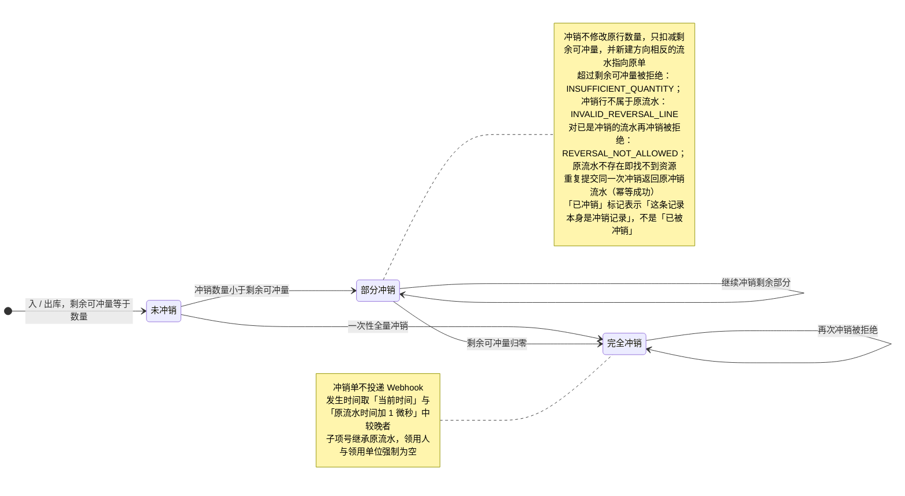

### 已确认流水的修改（重放）

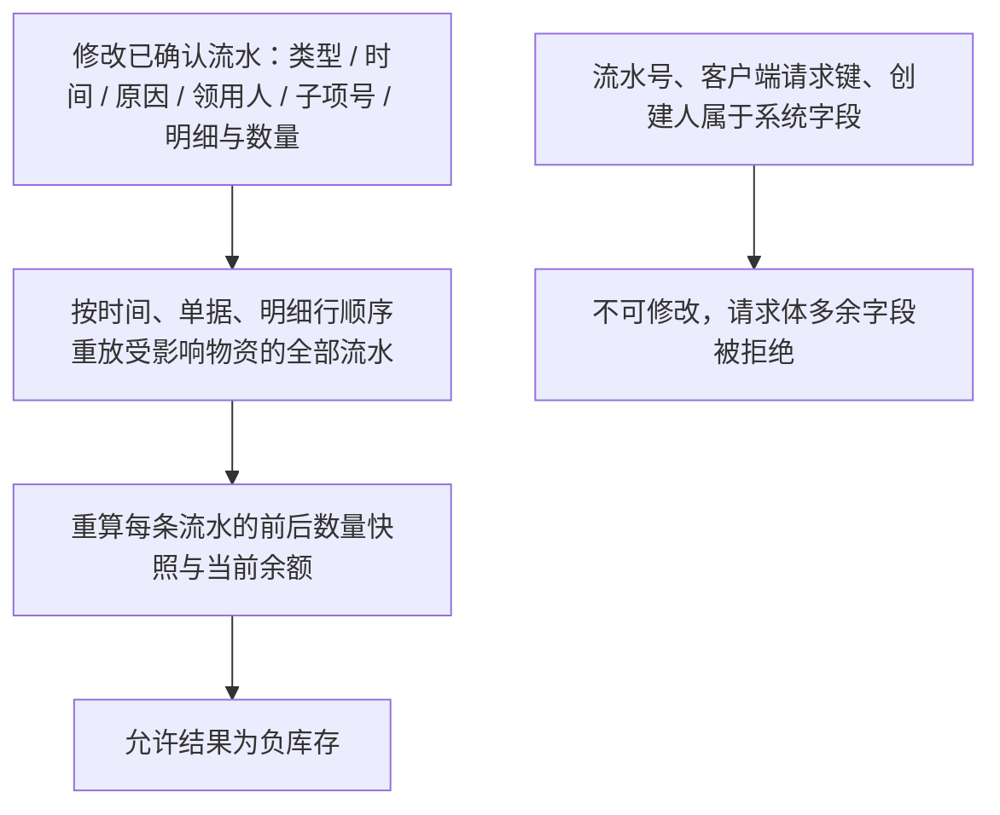

### 余额与小程序库存标签

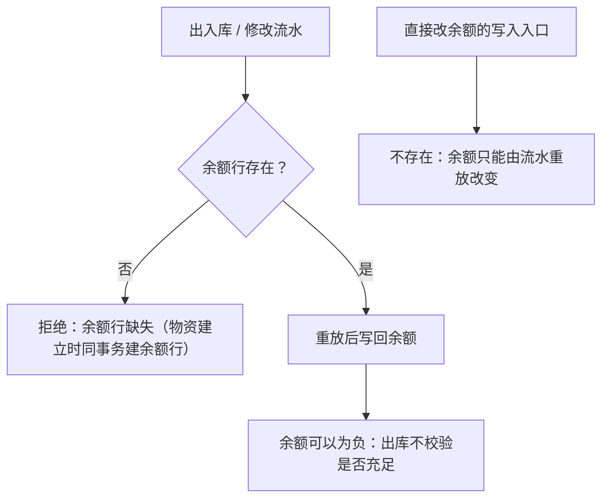

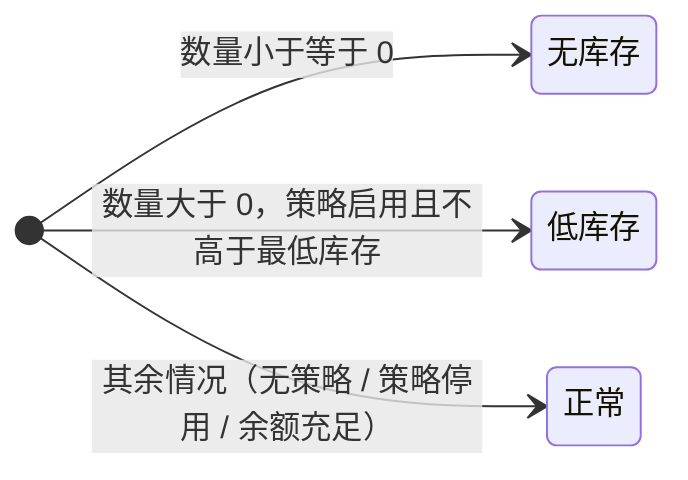

这三个标签是查询时算出来的，不落库；列表筛选与标签用同一套判定。

</TabsContent>

<TabsContent id="t2">

### Excel 导入任务

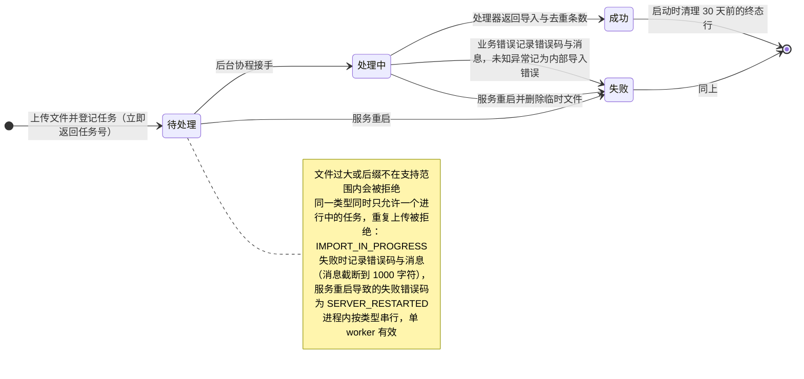

| `import_type` | 必需表头 | 写入方式 |
| --- | --- | --- |
| `LITE_INVENTORY` | 物资名称、型号规格、单位、数量、备注 | 全量替换（`DELETE` 全表 + 分批 2000 行 `INSERT`，单次 `commit`），无逐行状态 |
| `MATERIAL_CODE_LIBRARY` | 编码、名称、型号、记账单位名称 | 同上 |
| `HUAXING_INVENTORY` | 见导入模板 | 同上 |

解析失败的错误码以类型前缀区分，如 `LITE_IMPORT_HEADERS_MISSING`、`HUAXING_IMPORT_CODE_REQUIRED`、`MATERIAL_CODE_IMPORT_DUPLICATE`。

### Excel 导出任务

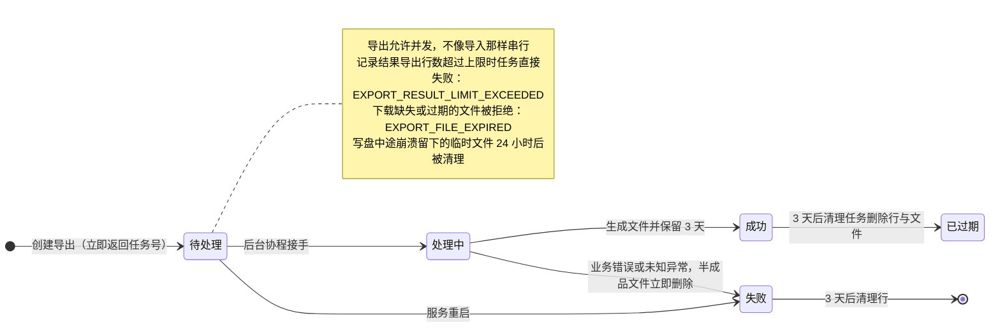

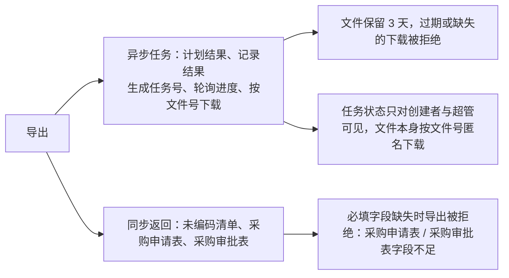

### Webhook 投递

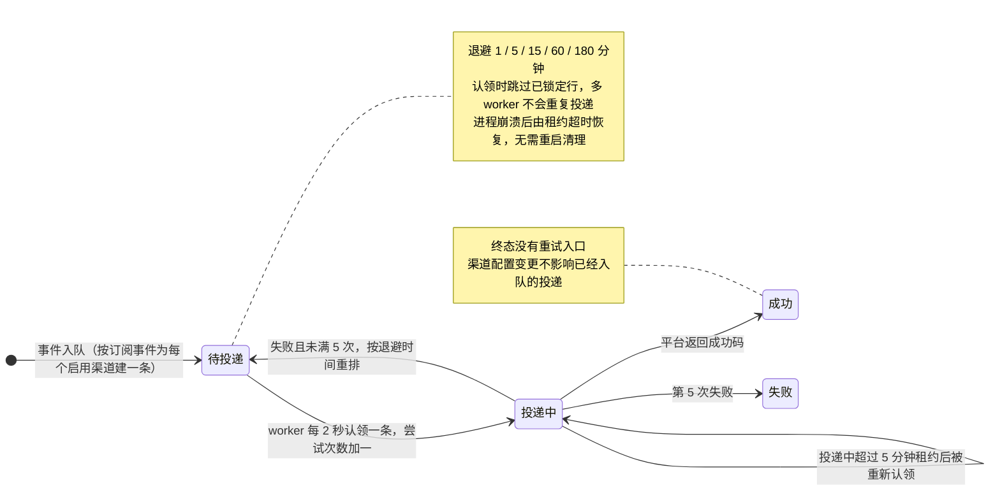

渠道配置本身的校验与结果：

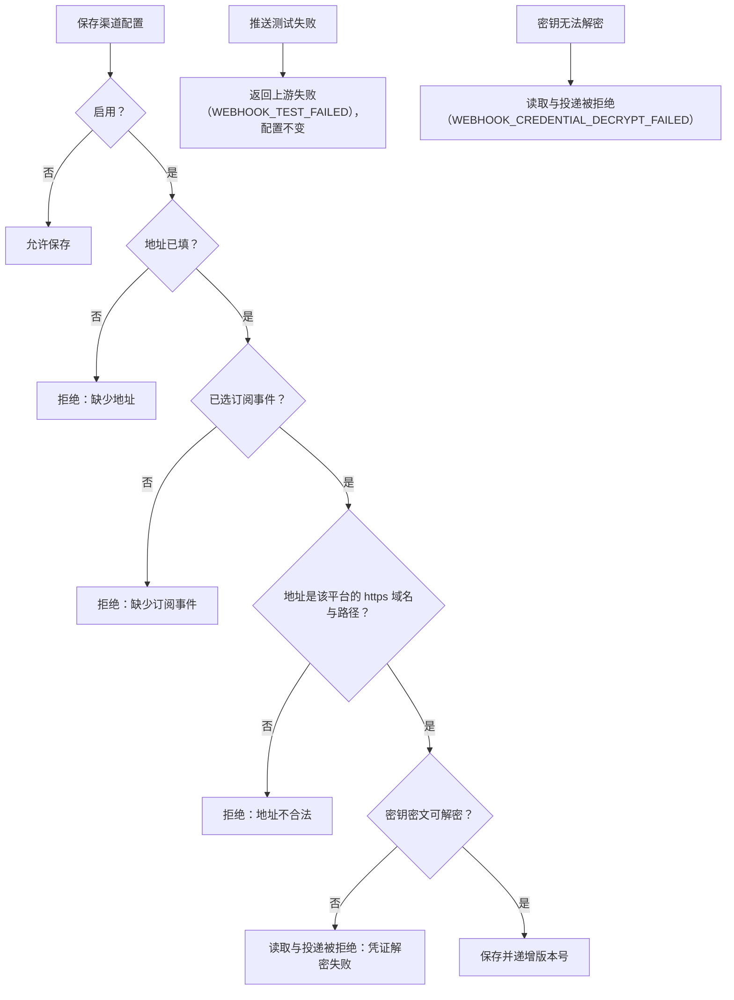

新建渠道时传入的版本号与库中不一致会被拒绝；地址与事件缺失、地址非法分别报缺少地址 / 缺少订阅事件 / 地址不合法。

</TabsContent>

<TabsContent id="t3">

### 小程序用户

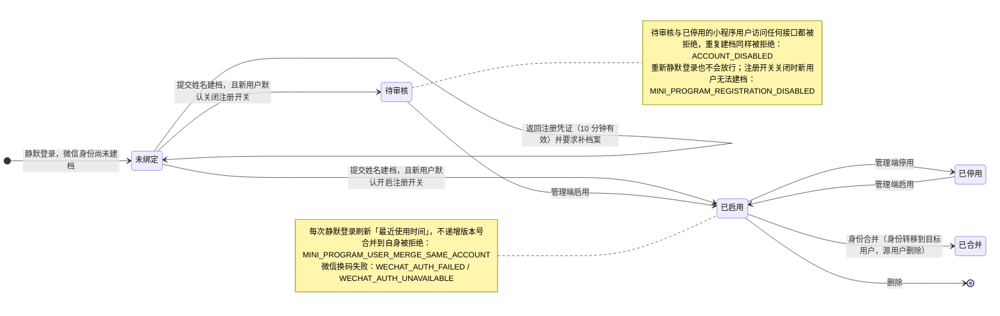

### 小程序功能模式

配置存在系统设置里，超管在高级设置中修改，小程序启动时拉取；拉取失败时小程序用默认值兜底。

| 配置项 | 默认值 | `disabled` | `query_only` | `read_write` |
| --- | --- | --- | --- | --- |
| `inventory_mode`（二级库库存） | `read_write` | 隐藏入口 | 只读 | 可扫码出库 |
| `huaxing_inventory_mode`、`purchase_plans_mode`、`purchase_records_mode`、`material_codes_mode` | `query_only` | 隐藏入口 | 只读 | —（默认只读） |

### 二级库运行模式

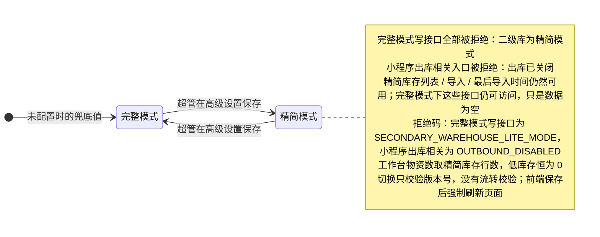

### 物资小程序码

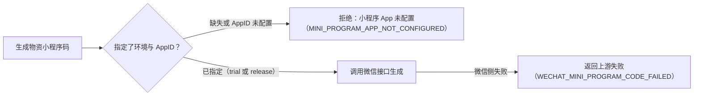

### 分享链接生命周期

```mermaid
stateDiagram-v2
    direction LR
    [*] --> 生效 : 创建分享（按选项换算到期时间，永久则无到期时间）
    生效 --> 生效 : 修改展示列或到期时间（含改为永久）
    生效 --> 已过期 : 到达到期时间，行仍在库中
    生效 --> [*] : 撤回（行被删除）
    已过期 --> [*] : 每日清理任务删除行
    note right of 生效
        展示列为空表示默认列：该类型的全部列去掉「状态」
        非创建者且非超管不能修改或撤回
        勾选项包含不存在的计划 / 记录会被拒绝
    end note
    note left of 已过期
        读取已过期链接：SHARE_EXPIRED；读取不存在的链接：SHARE_NOT_FOUND
        展示列包含该类型不支持的列会被拒绝；非创建者且非超管的修改或撤回被拒绝
    end note
```

</TabsContent>

</Tabs>

相关页面：[数据模型](/dev-data-model)、[数据流](/dev-flows)、[架构设计](/dev-architecture)。
